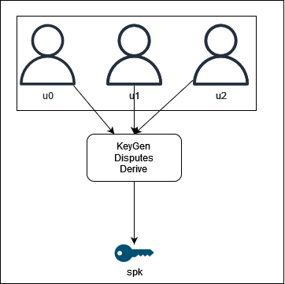
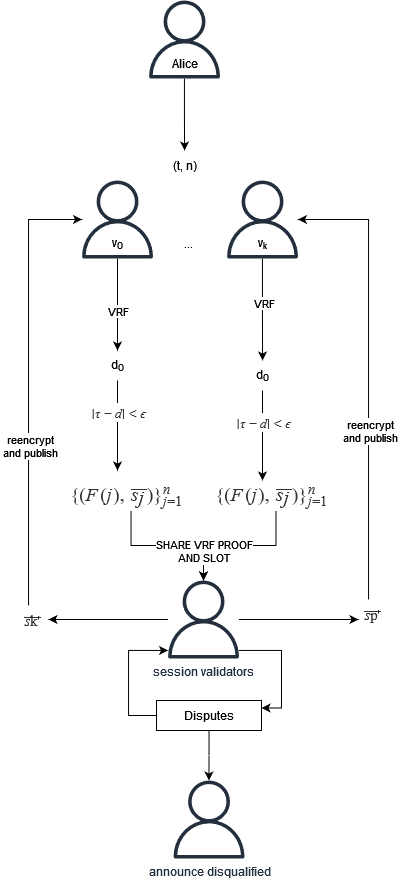

# Cryptex

- **Team Name:** Ideal Labs
- **Payment Address:** 0x0TODO
- **[Level](https://github.com/w3f/Grants-Program/tree/master#level_slider-levels):** 2

## Project Overview :page_facing_up:

### Overview
Alice has a document that she wants to make available to anybody who can meet some set of rules, but Alice will not be available in the future to hand over the document. Since Alice will not be available, she splits her secret data into pieces, or shares, and gives a single piece to anybody who she thinks will be available later and tells each person some condition that someone should prove to get a share. Then, if Bob appears later and can prove that they have met Alice's rules and enough of the people who have shares believe Bob, then they give a copy to Bob and Bob is able to reassamble Alice's document and read her secret.

This type of sharing is made possible thanks to threshold secret sharing, first introduced by [Shamir](https://web.mit.edu/6.857/OldStuff/Fall03/ref/Shamir-HowToShareASecret.pdf). However, TSS by itself has several issues, and so verifiable secret sharing schemes have been developed to allow for the verification of shares (such as [Feldman's scheme](https://www.cs.umd.edu/~gasarch/TOPICS/secretsharing/feldmanVSS.pdf), which ours closely mirrors). The setup, however, still depends on a trusted party to generate the shares. Thus, a distributed key generation protocol is a protocol to generate shares in a trustless way, with no third party needed. 

In this proposal, we introduce our protocol, blind DKG, where validators are incentivized to participate in a distributed key generation protocol. In essence, our proposal is similar to a threshold proxy reencryption protocol, however, it eliminates the need for a trusted proxy by using a distributed key generator, as well as introduces a mechanism for validators to communicate 'blindly'. It allows for a trustless key generation and reencryption (i.e. secret sharing) process. When implemented as part of a decentralized network (such as a blockchain), it enables a system where you can create a distributed secret and derive numerous provably owned (by onchain identity) public keys that can then be used to encrypt data, while the network becomes responsible for reencrypting it. Additionally, we extend the protocol to enable a 'cryptographic gate' to data access, wherein an owner of some data can define rules to delegate decryption rights. 

The mechanism is both non-interactive, in that Alice does not need to interact with Bob in order to delegate decryption rights, and also has no trusted setup. Alice does not need to trust the set of participants holding the pieces of her secret (nor even know their identitites).

### Project Details

Blind DKG is a protocol to enable a decentralized, unstoppable, yet governable secret key custodian. To start, we provide a brief overview of secret sharing and distributed key generation. Then, we will this to explain the idea for our protocol.

#### Background: Secret Sharing and Distributed Key Generation

##### Secret Sharing

Threshold secret sharing is a cryptographic protocol to encrypt a secret so that it can only be recovered if a threshold of participants participate. To be explicit, it can be thought of as the secret key being split into 'shares' and distributed to a set of shareholders. When a minimum threshold of shareholders reveal their shares, the secret is revealed. The basis of this scheme is thanks to interpolation of Lagrange polynomials. A LaGrange polynomial is any n-degree polynomial of the form $f(x) = \sum_{i=0}^n a_ix^i$ over some field. In a secret sharing scheme, we assume that this polynomial is over a finite field of prime order $q$, with coefficients $a_i \in \mathbb{Z}_q$.

The basis of a TSS protocol is thanks to Lagrange interpolation, which basically says that if you have $n$ points $(x_1, y_1), ..., (x_n, y_n)$, then there is a **unique** polynomial $f(x)$ whose degree is less than $n$ which passes through them. The degree of the polynomial $f$ is what we will mean by the 'threshold'. In a secret sharing scheme, a polynomial of degree $t < n$ is used, where $t$ can be configured as an input parameter.

To share a secret, a polynomial $f$ of degree $t$ can be created, with coefficients randomly sampled over the integers modulo a large prime, and where the first coefficient is the secret to be shared. The polynomial can then be evaluated at $n$ points and each value, or 'share' can be transmitted to a shareholder. Later on, the secret can be recovered when a threshold of the shares that were distributed are collected by reconstructing the polynomial $f$ through interpolation, and evaluating $f(0)$, which is our secret. With this, Alice can distribute the shares among $n$ participants, and later on Bob only needs to collect $t$ shares from them to recover the secret. 

This basic secret sharing scheme can be extended in order to make the distributed shares 'verifiable', in the sense that the recipient of a share can verify if what it received from another participant was truly a share from some polynomial or if it is some other value. This is done by publishing a commitment to the polynomial along with the shares. This type of scheme is called a 'verifiable secret sharing' scheme, and is what we will use in our construction.

##### Distributed Key Generation

By itself, VSS still requires a 'dealer' to generate the secret polynomial $f$ and distribute shares. This places a large degree of trust on the dealer. Also, there is not a clear way to make the sharing of a secret both trustless and non-interactive. To make it non-interactive, a semi-trusted set of  proxies (shareholders) are needed to reencrypt the data. To make it trustless would require that the owner of some data 'sign off' in order to make a secret available to another participant, which provides no clear way to scale. 

Some solutions, such as the Lit protocol, use a similar mechanism, using a DKG to start a TSS process. Additionally, they perform the computations using keys within a TEE. However, in their protocol, each member of the validator set is a shareholder, and so generating new keys is very expensive. I doubt that the network could scale to handle reencryption hundreds of keys within a small timeframe, whereas our solution is highly scalable.

Distributed key generation, or DKG, allows for shares (which can be used in a threshold encryption scheme), to be generated in a trustless way. Our scheme, inspired by the [ethDKG scheme](https://eprint.iacr.org/2019/985), is composed of three major phases: the sharing phase, the disputes phase, and the key derivation phase. During the sharing phase, a subset of the participants, called the dealer set, selects a random bivariate polynomial and publishes a commitment to the polynomial as well as derives a 'share' for each member of the dealer set (other than itself) and publishes it onchain. After a dealer shares its generated shares with other dealers, the disputes phase begins, in which dealers prepare zero-knowledge proofs of the invalidity of any shares they are claiming as invalid. If a threshold of dealers believe the proof, then the share is marked is disqualified from the rest of the protocol. Finally, in the key derivation phase, a qualified subset of the initial dealer set is determined and a master public key and secret is able to be determined. 

Once a master public key is known, it can be used to encrypt some secret. Later, through the VSS scheme, the secret can be made available to another participant by 'reencrypting' the shares used for the master public key used and sharing with the other participant. In our network, we will assume that each address has a public/secret keypair associated with it. Thus, by reencryption, we mean that each shareholder decrypts their share, then encrypts it again using some public key (e.g. the pubkey of the address who should receive shares) and publishing it.

#### Our Proposal

Though a DKG scheme might solve the problem of securely generating the keys, it still does not allow for a 'fully decentralizable' protocol. First is the issue of choosing which participants in the network are selected to act as dealers. If this set is centralized or static, then the network is more centralized, and potentially less secure. Secondly, assuming that through some mechanism that the set of participants in the DKG are randomly distributed among the available candidates, how can we be sure that the selected participants will be willing to participate in the DKG to begin with? Or if they do, how can we be sure that our secret can be reencrypted later? EthDKG solved this with smart contracts, but contracts provide limited capabilities.

We propose consensus-backed DKG protocol for blockchains. We envision that such a protocol can enable a truly decentralized and unstoppable secret key custodian. Our initial phase enables a DKG process where participation is incentivized by rewards provided by the network, and shares are secured by the stake of each participant in the DKG protocol. The mechanisms allows for the formation of 'societies' whose members, each a validator, participated in the DKG process together. Subsequently, a 'society' can be represented by an onchain asset class, owned by some participant of the network who requested that the secret key be created. By itself, the asset class simply points to ownership/leadership of the society. However, by minting a token, we enable a process by which a new distributed public key can be generated by the society and encoded in an onchain asset class. These public keys can then be used to encrypt data. The encrypted data can then be uploaded to some external storage (e.g. IPFS), and it's location can be encoded onchain. 

Now, we propose an extension to the DKG/VSS mechanism above. In our new construction, we allow the owner of a society to prepare a ZK SNARK to encode a statement in the blockchain's state, for example, using R1CS to encode a requirement for ownership of some specific NFT, or having a minimum balance, etc. This is a publicly verifiable SNARK. Along with the (multi)location if the ciphertext, the encryptor also shares the common reference string (CRS) and the relation used (i.e. the condition in the blockchain's state) to generate the CRS. This is then associated with the public key that encrypted it. For example, a mapping like: $PK \to (R, \sigma, /ip4/.../QmX99dAd...)$. It should be publicly verifiable that an owner 'owns' the public key, but there is no direct mapping between the public key and the society. However, the members of the society are still able to determine if the public key belongs to them.

When a third party, say Bob, wants to get access to some ciphertext, he prepares a merkle proof of his state that he claims meets the conditions defined by Alice. Then, he prepares a zk proof claiming that his Merkle proof satisfies Alice's condition. If a threshold of shareholders can verify this proof, they each reencrypt a share for Bob. After a threhsold are reencrypted, Bob can recover the secret.

##### What this is not
- As this is a 'KEM', key encapsulation mechanism, there are a few implications:
  - This protocol does not encrypt or decrypt data for you, only keys. Data encryption and decryption must still be handled outside of the main protocol, though we scope out a user interface that demonstrates how handle that in the browser.
  - This protocol is not a decentralized storage solution. The management and storage of data that is encrypted with keys generated this way must still be handled offchain.

### Blind DKG Protocol

To begin, our protocol has two main DKG algorithms. The first is among a publicly known validator set, and the second is among a 'blind' validator set.

#### Session Validators and  Session Public Key Derivation

In the first phase of the protocol, a fixed amount of *session validators* are selected. In fact, we will be contstructing a (t, n)-VSS scheme among the session validator set. This idea has been used in [HoneyBadgerBFT](https://eprint.iacr.org/2016/199.pdf) previously, so we may want to explore atomic broadcast in the future. The idea is that this set of validators can reencrypt data for other validators later on without the validators knowing each others identities. This forms the basis for the 'blindness' of our ultimate keygen construction, and also ensure that we are given a unique, randomly sampled session public key for each session. At the end of each session, rewards will be calcualted and distributed based on session validators' stake and performance during the session. The values for $\tau$ and $\epsilon$ are TBD. but will be well known among all validators.

1. A session's planning phase begins.
2. Using a commonly known number $\tau$ and $\epsilon$, each validator calculates a random number using a VRF and commits to it. For the calculated value, $d$, 
3. If $|\tau - d| \lt \epsilon$, then the validator can consider itself 'chosen' and begins to participate in the DKG process by generating a secret share, as well as a secret polynomial, commitment to that poly, and secret shares. 
4. When ready, participants publish their proof that their VRF output makes them a session validator and commitments to the polynomial. 
5. When another node *publicly* announces its ability to participate and commits to its poly (i.e. step (3)), then encrypt a secret key share for that identity and publish it onchain along with its proper commitment.
6. The validators dispute invalid shares. This is elaborated on [here](#disputes-phase).
7. If a threshold of session validators participate honestly, then a session public key can be calculated.
 

 

The values for the size of the session validator set, $n$ and the thresold $t$ are a function of the total size of the network. That is, if there are more keys that need to be held and reencrypted, then the number of session validators should be increased in order to process each. However, this poses an issue in regards to scalability. It implies that the validator set will need to continuously grow in order to facilitate more 'reencryption bandwidth', unless we limit the bandwidth to some certain number of keys generated or reencrypted per block. We do not yet have a solution for this, but will actively research potential approaches.

#### Ad-Hoc DKG and Secret Societies
note to self:[info on vrfs](https://wiki.polkadot.network/docs/learn-randomness)

Now that the session validators have provided a session public key, we can instantiate ad-hoc *blindly* dkg using other members of the validator set. During each session, a participant can issue a 'request' to start the DKG by proving a number of shares and a threshold, $(t, n)$. Then, 'secret societies' can be formed, wherein each member has a secret key share. The protocol (for a single request) is as follow:

1. A participant issues a request to start the DKG, $(t, n)$
2. Validators can choose to 'bid' on being in the group by generating a VRF output and publishing a commitment to it onchain.
3. If $|\tau - d| \lt \epsilon$, then the validator can consider itself 'chosen' and begins to participate in the DKG process by generating a secret share, as well as a secret polynomial, commitment to that poly, secret key shares. That is, they calculate $\{(F(j), f(j))\}_{j=1}^n$. 

Up until now, this has pretty much been the same as the previous section. But now, we make a change. In order to share the secret key shares, they need to be encrypted. However, since we want to continue to maintain the anonymity of the validators who think they've won, we can't possibly encrypt the shares because we don't have any public keys. This is where the session public key comes in. Instead of encrypting for a specific validator, the keys are encrypted using the session public key.

4. Encrypt each key share using the session public key, generating secret shares $\overline{s_j} := E_{spk}(f(j))$ for $j = 1, ..., n$.
5. Generate your slot number, $sl$. Slot numbers will be important later on when the session validators are reencryption secret shares. Since we are doing $(t,n)-VSS$, there are a total of $n$ slots that must be assigned. Since we are only choosing validators in the range $|\tau - d| \lt \epsilon$, then we need to ensure that there are $n$ discrete slots in that range as well.  I need to put a little more thought into this, but for now just assume they are each able to randomly assign themselves a slot, and that this is done in a way so the slots tend to be non-overlapping. This probably implies we will need to have more than $n$ participants in each DKG to begin.
6. Publicly announce the encrypted shares, commitments to the polynomial, and proof that you could participate, however, this proof should only be verifiable by a member of the session validator set -> I'm unsure if this means we need to make changes to the VRF itself? Technically, I think this is the weakest step. Here, you could probably just look at who sent commitments and figure out the society's members. Need to come back to this.
7. When other participants announce the information above, the session validator set becomes responsible for acting as a 'secret key transport layer' in a way. When a validator submits a valid proof of ability to participate, along with its selected slot number, each SV (session validator) validates the proof and reencrypts shares for the validator. That is, they reencrypt up to $n$ shares that were published by the other members of the secret society. We will assume that each validator reserved $f(sl)$ as its own share, and so each session validator participates in the reencryption process, reencrypting its individual share and publishing it onchain, along with the identity of the recipient.
8. Finally, each participant receives a set of encrypted key shares that they can then decrypt, derive public keys from, and reencrypt.
9. For a subset of the society that passed the disputes phase, a default public key can be derived. We elaborate on that [here](#key-derivation).

Now, we need to explore how to look at this onchain. My inital thoughts is that the secret society is like an asset class, and public keys are like assets. This could actually work I think. But, the problem is how to keep the societies secret? If you're in a society, you need to have some secret knowledge. And you do, that's the secret key share.

 

#### Disputes Phase

The disputes phase occurs as a subprocess of both of the above keygen algorithms. When a share is invalid, is must be ejected from the protocol. If an adversary issues an invalid share, then honest participants should issue a dispute against it. In order to ensure an adversary cannot falsely dispute the validity of a share, we place the burden of proving invalidity onto the party issuing a dispute. This is accomplished by using zk SNARKs. There are two flavors of this algorithm that we use. First, among the session validators, and secondly among a secret society.

##### Disputes Phase for Session Validators

The disputes phase for validators is very simple.

1. Since session validators all agree on the same 'group generator', when a session validator receives a share from another validator it can verify if it is a valid share. Each session validator verifies each share it recieves. If a share is valid, then there is no dispute.
2. If a share is invalid, the prepare a (zk) proof that the share is invalid and publish it.
3. If a threshold $t$ of other validators verify the proof, then the share is rejected from the protocol. Here, the identity of the validator who provided a bad share can be publicly announced as well.

At the end of this, if any validator submitted an invalid share we consider them an adversary, and their stake will be slashed.

##### Disputes Phase for Secret Societies

The disputes phase for secret societies is quite a bit different than for session validators. In effect, the society relies on the session validators to ensure the validity of shares that they receive. During the DKG, when a participant proves its valid VRF output to the session validator set, the session validator set will facilitate the disputes process by verifying each share when it is asked to reencrypt it. This functions identically to the disputes phase for session validators.

#### Encryption

Encryption is accomplished by using asymmetric encryption (e.g. ECDH), using the public key as derived above. Subsequently, the resulting ciphertext is added to some storage system and a multiaddress is published onchain. 

#### Secret Sharing

After encrypting some data using the public key that you own, and which is emergent from some secret society, you may want to share that information with someone else, identified as another participant in the network. To do so, we need to the secret society to reencrypt the shares for the new participant. In one sense, a secret society is really just any set of nodes who can prove all of their shares came from the same polynomial. So when we need to reencrypt data using this secret society, we really want to issue a 'request' that asks "If you can prove your share came from the polynomial whose commitment is given by $F(x)$, then please reencrypt a key".

So, to enable secret sharing with a secret society, we create a struct, similar conceptually to an asset class, with some associated commitment to a polynomial, $F(x)$, and an owner, the participant who initiated the DKG. By attesting its ownership of the commitment, the owner can issue commands to the network (i.e. via an extrinsic) to both `derive` new public keys and to `reencrypt` secret keys. This is done by issuing a transaction that encodes the commitment, $F(x)$ and rewards any participants who provide a valid share. How can this be done in a way that preserves the secrecy of the society? As long as the formation is secret, keeping it forever secret isn't that big a deal.

Finally, the recipient of the shares can verify each share, rejecting invalid ones, and only rewarding participants who provided a valid share. At this point, the identities of the society are revealed. We will explore 'member rotation' in the future, however, for now we will just assume this is acceptable.

#### ZK Gating for Data

TODO

#### Session Changes/New Sessions

TODO

#### Proposed Architecture

- We intend to use a modified version of Babe for block authorship
  - do we need to modify it or not? I think we will, but I'm not really sure yet...
- We will use Grandpa for block finalization
- We will build a DKG pallet. The DKG pallet:
  - stores and manages a queue to issue DKG requests
  - 
- We will build a SDK with the following capabilities to allow developers and protocols to interact with cryptex:
  - **Encryption:** provides types and functions to encrypt and decrypt secrets. 
  - **VSS Client:** provides types and functions to interact with the protocol, some examples of such interactions are encryption key requests and secret sharing requests.
  - **ZK:** provides types and functions to define zk-SNARKS and Zero-knowledge proofs. They are required as part of the Blind DKG flow to define restrictions/rules that must be meet to get access to shared secrets, and to provide a proofs that requirements to access a shared secret are satisfied.
  - **Rules** **DSL:** a domain specific language to define/model access rules required to get access to  a shared secret. Once defined, rules are packaged/translated to zk-SNARKS. In future versions we will build a graphic editor to define these rules using our DSL as building block.
  - **Storage:** provides types and functions to save/read/update cyphered documents through different datasource options. The first version will provide IPFS as data storage option but we are going to expand this module in the future to include centralized options as well such S3, Google Drive, between others.
  - **Graphql API:** provides types and functions to fetch data saved on-chain related to Blind DKG in a developer friendly way.
### Ecosystem Fit

Help us locate your project in the Polkadot/Substrate/Kusama landscape and what problems it tries to solve by answering each of these questions:

- Where and how does your project fit into the ecosystem?
- Who is your target audience (parachain/dapp/wallet/UI developers, designers, your own user base, some dapp's userbase, yourself)?
- What need(s) does your project meet?
- Are there any other projects similar to yours in the Substrate / Polkadot / Kusama ecosystem?
  - If so, how is your project different?
  - If not, are there similar projects in related ecosystems?
---
- Cryptex/Blind DKG provides new secret sharing capabilities to the ecosystem.
- It stores their secrets in a decentralized way, and have them available to them when they need them, without having to trust a third party.
- There are no similar projects in the Substrate / Polkadot / Kusama ecosystem. We have found though that there are projects that are somehow similar in other ecosystems:
  - [b.lock](https://github.com/BlockProject/b-lock)
  - [DaPassword](https://cardano.ideascale.com/c/idea/332494)
  - [Blockchain password](https://margatroid.github.io/blockchain-password/#/)
  - [You](https://medium.com/airgap-it/you-the-decentralized-password-manager-2f521cced7be)
  - [Lit Protocol](https://litprotocol.com/): We share many similarities with this protocol as it is built on the same underlying technology, using DKG and TSS. However, lit only enables on layer of TSS, similar to our 'session public key'. Additionally, it does not use zk SNARKs or other privacy preserving tools. I believe that Lit would not scale well, whereas this protocol does. 
  - [Share](https://share.formless.xyz/)

## Team :busts_in_silhouette:

### Team members

- Tony Riemer
- Carlos Montoya
- Juan Girini

### Contact

- **Contact Name:** Full name of the contact person in your team
- **Contact Email:** Contact email (e.g. john@duo.com)
- **Website:** https://www.idealabs.network/

### Legal Structure

- **Registered Address:** Address of your registered legal entity, if available. Please keep it in a single line. (e.g. High Street 1, London LK1 234, UK)
- **Registered Legal Entity:** Name of your registered legal entity, if available. (e.g. Duo Ltd.)

### Team's experience

Please describe the team's relevant experience. If your project involves development work, we would appreciate it if you singled out a few interesting projects or contributions made by team members in the past. 

If anyone on your team has applied for a grant at the Web3 Foundation previously, please list the name of the project and legal entity here.

### Tony Riemer

Tony has previously worked on 1.5 web3 foundation grants in the past for the Iris project (link here). 

### Carlos Montoya
Carlos has been doing software for more than 20 years now, most recently in the startup world. 
- **Education**
Carnegie Mellon University
Master of Science Information Technology, 2011 - 2013
Tecnológico de Monterrey
Master in Information Technology Management, 2011 - 2013
Universidad Pontificia Bolivariana
Innovation and Technoogy Management, 2009 - 2010
Universidad Autónoma de Manizales
Systems Engineer, 1997 - 2002
- **Blockchain Experience**
Through 2022 Carlos had the chance to learn a lot about building smart contracts with solidity, and took part of some encode-club bootcamps and ETH Global hackathons. During this period of time he built several apps, one of them a decentralized job-board app and protocol called [web3Jobs](https://ethglobal.com/showcase/web3jobsfevm-inz64) ([Repo](https://github.com/encode-g2-project)). At the same time he started to learn rust and recently took part of the polkadot academy in Buenos Aires with very good performance. During the polkadot academy he was able to build a uniswap V2 Dex pallet, and XCM communication scenario, and some other cool use cases.
- **Software Engineering Experience**
  - Between 2004 and 2015, at [MVM Software Engineering](https://www.mvm.com.co/?lang=en), a technology firm with a deep focus in the energy industry, he was in charge of defining the way of doing great software for the entire company, leading the most skilled people, building the most complex software products and managing hundreds of initiatives for helping the company to expand its operations in Colombia, Dominican Republic, and Mexico. 
  - Between 2016 and 2020 he was completely focused on building [StellarEmploy](https://www.stellaremploy.com) with his co-founders, where we had the opportunity to take part of NY ERA accelerator, and got institutional Money. StellarEmploy technology was recently acquired by Learning Collider.  
  - Since early 2021 Carlos has been focused mainly on [TeamClass](https://www.teamclass.com), a b2b marketplace for helping companies with their team-building initiatives through virtual events. We bootstrapped TeamClass ourselves and made sales by 3.8M in our first year.
### Juan Girini

### Team Code Repos

- https://github.com/<your_organisation>/<project_1>
- https://github.com/<your_organisation>/<project_2>

Please also provide the GitHub accounts of all team members. If they contain no activity, references to projects hosted elsewhere or live are also fine.

- https://github.com/driemworks
- https://github.com/carloskiron
- https://github.com/juangirini

### Team LinkedIn Profiles (if available)

- https://www.linkedin.com/in/tony-riemer/
- https://www.linkedin.com/in/cmonvel/
- https://www.linkedin.com/in/juan-girini/

## Development Status :open_book:

If you've already started implementing your project or it is part of a larger repository, please provide a link and a description of the code here. In any case, please provide some documentation on the research and other work you have conducted before applying. This could be:

- links to improvement proposals or [RFPs](https://github.com/w3f/Grants-Program/tree/master/docs/RFPs) (requests for proposal),
- academic publications relevant to the problem,
- links to your research diary, blog posts, articles, forum discussions or open GitHub issues,
  - share my white paper here
  - share previous grants
- references to conversations you might have had related to this project with anyone from the Web3 Foundation,
- previous interface iterations, such as mock-ups and wireframes.

- We have started an article series to try to elaborate on these topics more in depth: https://ideallabs.substack.com/p/blind-dkg-part-1
- we have started a whitepaper to formally define and analyze these ideas. We intend to complete this paper as part of this grant as well.

## Development Roadmap :nut_and_bolt:

### Overview

- **Total Estimated Duration:** 5 months
- **Full-Time Equivalent (FTE):**  2.5 FTE
- **Total Costs:** 49,999 USD

The outcome of our milestones is threefold:
1. Cryptext: A blockchain that uses the protocol above within
2. A DKG/VSS library
3. An SDK to build user interfaces and client side logic, to define secret sharing access rules, and to perform offchain encryption and decryption.

### Milestone 1 — Session Validator DKG

- **Estimated duration:** 1.5 month
- **FTE:**  2.5
- **Costs:** 10,000 USD

The first milestone introduces a new pallet to submit DKG requests to, we also implement the session validator DKG to create a session public key. We plan on implementing our DKG using the arkworks-algebra crates over curve25519. As such, the resulting session public key can be used in the same way as keypairs used as AccountIds in substrate. As such, owning a derived public key is kind of like owning an account.

In this milestone we will make changes to both FRAME, primitives, and client.

| Number | Deliverable | Specification |
| -----: | ----------- | ------------- |
| **0a.** | License | Apache 2.0 / GPLv3 / MIT / Unlicense |
| **0b.** | Documentation | We will provide both **inline documentation** of the code and a basic **tutorial** that explains how a user can (for example) spin up one of our Substrate nodes and send test transactions, which will show how the new functionality works. |
| **0c.** | Testing and Testing Guide | Core functions will be fully covered by comprehensive unit tests to ensure functionality and robustness. In the guide, we will describe how to run these tests. |
| **0d.** | Docker | We will provide a Dockerfile(s) that can be used to test all the functionality delivered with this milestone. |
| 0e. | Article | We will publish an **article**/workshop that explains [...] (what was done/achieved as part of the grant). (Content, language and medium should reflect your target audience described above.) |
| 1. | Library: DKG | We implement and test a DKG protocol implemented with arkworks. This inital version will follow the same approach as ethDKG. The first version of the protocol will have abilities to generate a key/poly, commit to it, and to encrypt it. |
| 2. | Substrate module: DKG Pallet | The DKG pallet will contain an extrinsic to create DKG requests. It will also contain the basis for representing societies onchain. That is, this pallet will also store a 'society' and and assets (public keys) minted from it. |
| 3. | SDK | We implement a simple SDK and a simple UI that uses it. The SDK will allow nodes to stake/unstake tokens as well as view session validators. They should be able to view their total rewards they've earned by participating in a session as well. |

### Milestone 2 — Ad-Hoc DKG/Secret Societies

- **Estimated Duration:** 1 month
- **FTE:**  2,5
- **Costs:** 8,000 USD

### Milestone 3 - zkSNARKs and Disputes Phase
- **Estimated Duration:** 1 month
- **FTE:**  2,5
- **Costs:** 8,000 USD

### Milestone 4 - Slashing, Rewarding, 
- **Estimated Duration:** 1 month
- **FTE:**  2,5
- **Costs:** 8,000 USD

...

## Future Plans

Please include here

- We would like to explore the usage of XCM in order to accomplish cross-chain 'data locks', wherein the proof of a condition on chain A (e.g. owning some specific asset on Ajuna) would equate to decyryption rights being granted in Cryptex.
- We intend to further enhance the protocol, to continue to research ways to make it more performant, more secure, and to make it more privacy preserving. In essence, we ultimate want to ensure that the 'society' that is formed to hold shares is a 'secret society', or rather a blind society.
- We intend to build tools on top of this functionality to enable developers to make use of the protocol.
- Short term intentions include further testing and enancements of the core protocol, building out simple tools and applications, such as a general secret sharing platform, and to work with engineers in web2 industries to prevent ways to decentralize their data architecture.

## Additional Information :heavy_plus_sign:

**How did you hear about the Grants Program?** Web3 Foundation Website / Medium / Twitter / Element / Announcement by another team / personal recommendation / etc.

Here you can also add any additional information that you think is relevant to this application but isn't part of it already, such as:

- Work you have already done.
- If there are any other teams who have already contributed (financially) to the project.
- Previous grants you may have applied for.
