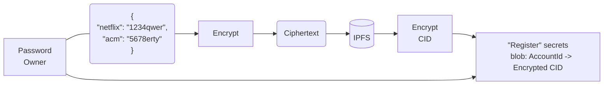

# Cryptex

- **Team Name:** Ideal Labs
- **Payment Address:** In the case of fiat payment, please share your bank account privately with grants@web3.foundation via your contact email (see below) and enter the date when you shared the information with us (e.g. Fiat 24.12.1971, 11:59) here. Otherwise, provide the BTC, Ethereum (USDC/DAI) or Polkadot/Kusama (USDT) payment address. Please also specify the currency. (e.g. 0x8920... (DAI))
- **[Level](https://github.com/w3f/Grants-Program/tree/master#level_slider-levels):** 2

## Project Overview :page_facing_up:

### Overview
Alice has a document that she wants to make available to anybody who can meet some set of rules, but Alice will not be available in the future to hand over the document. Since Alice will not be available, she splits her secret data into pieces, or shares, and gives a single piece to anybody who she thinks will be available later and tells each person some condition that someone should prove to get a share. Then, if Bob appears later and can prove that they have met Alice's rules and enough of the people who have shares believe Bob, then they give a copy to Bob and Bob is able to reassamble Alice's document and read her secret.

This type of sharing is made possible thanks to threshold secret sharing, first introduced by [Shamir](https://web.mit.edu/6.857/OldStuff/Fall03/ref/Shamir-HowToShareASecret.pdf). However, TSS by itself has several issues, and so verifiable secret sharing schemes have been developed to allow for the verification of shares (such as [Feldman's scheme](https://www.cs.umd.edu/~gasarch/TOPICS/secretsharing/feldmanVSS.pdf), which ours closely mirrors). The setup, however, still depends on a trusted party to generate the shares. Thus, a distributed key generation protocol is a protocol to generate shares in a trustless way, with no third party needed. 

In this proposal, we introduce a blockchain with a new consensus mechanism, ZK-DKG, where validators are incentivized to participate in a distributed key generation protocol. It allows for a trustless key generation and reencryption (i.e. secret sharing) process. When implemented as part of a decentralized network (such as a blockchain), this consensus mechanism it enables a system where you can create a distributed secret and define a condition using ZK SNARKs that can be cryptographically verified against some state so that later on, any other participant in the network can submit a proof and, if valid, have decryption rights delegated to them. ZK-DKG uses an approach similar to [ethDKG](https://eprint.iacr.org/2019/985), however our protocol is embedded as part of consensus and offers stronger security guarantees. Additionally, we extend the protocol to enable a 'cryptographic gate' to data access, wherein an owner of some data can define rules to delegate decryption rights. 

The mechanism is both non-interactive, in that Alice does not need to interact with Bob in order to delegate decryption rights, and also has no trusted setup. Alice does not need to trust the set of participants holding the pieces of her secret (nor even know their identitites). Along with ZK-DKG, we also propose to build a blockchain which uses this mechanism, called *Cryptex*. 

*note to self* it would be interesting to explore if there's any way to use something like honeybadgerbft as a grounds for this as well, maybe we can make some very promising claims on performance https://eprint.iacr.org/2016/199.pdf

### Project Details

We expect the teams to already have a solid idea about your project's expected final state. Therefore, we ask the teams to submit (where relevant):

- Mockups/designs of any UI components
- Data models / API specifications of the core functionality
- An overview of the technology stack to be used
- Documentation of core components, protocols, architecture, etc. to be deployed
- PoC/MVP or other relevant prior work or research on the topic
- What your project is _not_ or will _not_ provide or implement
  - This is a place for you to manage expectations and to clarify any limitations that might not be obvious

Using plain asymmetric encryption on the password blob, the entire doc is put in IPFS, and simply stored the association (AccountId32 -> encrypted CID of encrypted password file). Then when the owner wants to recover a password, they just need to recover the entire file. This is done by first decrypting the CID, then fetching the CID and decrypting the ciphertext to get the owner's passwords. Unless the owner has some crazy number of passwords, doing this from time-to-time shouldn’t be an issue, computationally. This isn’t specifically privacy preserving, but it is a starting point that can be factored in later. 

#### Secret Sharing and Distributed Key Generation

To start, we need a brief overview of secret sharing and distributed key generation. Then, we will explain the idea for our new consensus mechanism.

##### Secret Sharing

Threshold secret sharing is a cryptographic protocol to encrypt a secret so that it can only be recovered if a threshold of participants participate. To be explicit, it can be thought of as the secret key being split into 'shares' and distributed to a set of shareholders. When a minimum threshold of shareholders reveal their shares, the secret is revealed. The basis of this scheme is thanks to interpolation of Lagrange polynomials. A LaGrange polynomial is any n-degree polynomial of the form $f(x) = \sum_{i=0}^n a_ix^i$ over some field. In a secret sharing scheme, we assume that this polynomial is over a finite field of prime order $q$, with coefficients $a_i \in \mathbb{Z}_q$.

The basis of a TSS protocol is thanks to Lagrange interpolation, which basically says that if you have $n$ points $(x_1, y_1), ..., (x_n, y_n)$, then there is a **unique** polynomial $f(x)$ whose degree is less than $n$ which passes through them. The degree of the polynomial $f$ is what we will mean by the 'threshold'. In a secret sharing scheme, a polynomial of degree $t < n$ is used, where $t$ can be configured as an input parameter.

To share a secret, a polynomial $f$ of degree $t$ can be created, with coefficients randomly sampled over the integers modulo a large prime, and where the first coefficient is the secret to be shared. The polynomial can then be evaluated at $n$ points and each value, or 'share' can be transmitted to a shareholder. Later on, the secret can be recovered when a threshold of the shares that were distributed are collected by reconstructing the polynomial $f$ through interpolation, and evaluating $f(0)$, which is our secret. With this, Alice can distribute the shares among $n$ participants, and later on Bob only needs to collect $t$ shares from them to recover the secret. 

This basic secret sharing scheme can be extended in order to make the distributed shares 'verifiable', in the sense that the recipient of a share can verify if what it received from another participant was truly a share from some polynomial or if it is some other value. This is done by publishing a commitment to the polynomial along with the shares. This type of scheme is called a 'verifiable secret sharing' scheme, and is what we will use in our construction.

##### Distributed Key Generation

By itself, VSS still requires a 'dealer' to generate the secret polynomial $f$ and distribute shares. This places a large degree of trust on the dealer. Also, there is not a clear way to make the sharing of a secret both trustless and non-interactive. To make it non-interactive, a semi-trusted set of proxies (shareholders) are needed to reencrypt the data. To make it trustless would require that the owner of some data 'sign off' in order to make a secret available to another participant, which provides no clear way to scale. 

Some solutions, such as the Lit protocol, use a similar mechanism, using a DKG to start a TSS process. Additionally, they perform the computations using keys within a TEE. However, in their protocol, each member of the validator set is a shareholder, and so generating new keys is very expensive. I doubt that the network could scale to handle reencryption hundreds of keys within a small timeframe, whereas our solution is highly scalable (I think... I need to analyze this more in depth).

Distributed key generation, or DKG, allows for shares (which can be used in a threshold encryption scheme), to be generated in a trustless way. Our scheme, inspired by the ethDKG scheme [ref], is composed of three major phases: the sharing phase, the disputes phase, and the key derivation phase. During the sharing phase, a subset of the participants, called the dealer set, selects a random bivariate polynomial and publishes a commitment to the polynomial as well as derives a 'share' for each member of the dealer set (other than itself) and publishes it onchain. After a dealer shares its generated shares with other dealers, the disputes phase begins, in which dealers prepare zero-knowledge proofs of the invalidity of any shares they are claiming as invalid. If a threshold of dealers believe the proof, then the share is marked is disqualified from the rest of the protocol. Finally, in the key derivation phase, a qualified subset of the initial dealer set is determined and a master public key and secret is able to be determined. 

Once a master public key is known, it can be used to encrypt some secret. Later, through the VSS scheme, the secret can be made available to another participant by reencrypted the shares used for the master public key used and sharing with the other participant.

#### Our Proposal

Though a DKG scheme might solve the problem of securely generating the keys, it still does not allow for a 'fully decentralizable' protocol. First is the issue of choosing which participants in the network are selected to act as dealers. If this set is centralized or static, then the network is more centralized, and potentially less secure. Secondly, assuming that through some mechanism that the set of participants in the DKG are randomly distributed among the available candidates, how can we be sure that the selected participants will be willing to participate in the DKG to begin with? Or if they do, how can we be sure that our secret can be reencrypted later? EthDKG solved this with smart contracts, but contracts provide limited capabilities.

We propose to integrate a DKG scheme into a consensus mechanism, based on proof of stake. Our initial phase, inspired by EthDKG, is to build a novel consensus mechanism, ZK-DKG, which will enable a DKG process where participation is incentivized by rewards provided by the network, and shares are secured by the stake of each participant in the DKG protocol. The mechanisms allows for the formation of 'societies' whose members, each a validator, participated in the DKG process together. Subsequently, a 'society' can be represented by an onchain asset class, owned by some participant of the network who requested that the secret key be created. By itself, the asset class simply points to ownership/leadership of the society. However, by minting a token, we enable a process by which a new distributed public key can be generated by the society and encoded in an onchain asset class. These public keys can then be used to encrypt data. The encrypted data can then be uploaded to some external storage (e.g. IPFS), and it's location can be encoded onchain. 

Now, we propose an extension to the DKG/VSS mechanism above. In our new construction, we allow the owner of a society to prepare a ZK SNARK to encode a statement in the blockchain's state, for example, using R1CS to encode a requirement for ownership of some specific NFT, or having a minimum balance, etc. This is a publicly verifiable SNARK. Along with the (multi)location if the ciphertext, the encryptor also shares the common reference string (CRS) and the relation used (i.e. the condition in the blockchain's state) to generate the CRS. This is then associated with the public key that encrypted it. For example, a mapping like: $PK \to (R, \sigma, /ip4/.../QmX99dAd...)$. It should be publicly verifiable that an owner 'owns' the public key, but there is no direct mapping between the public key and the society. However, the members of the society are still able to determine if the public key belongs to them.

When a third party, say Bob, wants to get access to some ciphertext, he prepares a merkle proof of his state that he claims meets the conditions defined by Alice. Then, he prepares a zk proof claiming that his merkle proof satisfies Alice's condition. If a threshold of shareholders can verify this proof, 

#### ZK-DKG Consensus Mechanism

Our proposed mechanism is as follows:

#### To encrypt:

#### To recover passwords:

 It’s just the opposite. Recovery is read-only and would come at no cost to the password owner, as it should be. Access to their own data should never come with a financial barrier.

```mermaid
graph LR
    
    Owner["Password
    Owner"] --> Get["Get encrypted CID
    from runtime storage"]
    Get --> Recover["Recover
    &#40;decrypt&#41; CID"]
    Recover --> Fetch["Fetch ciphertext
    from IPFS"]
    Fetch --> Decrypt["Recover
    &#40;decrypt&#41; plaintext"]
    Decrypt --> Plain("{
      #quot;netflix#quot;: #quot;1234qwer#quot;,
      #quot;acm#quot;: #quot;5678erty#quot;
    }")
```

Things that shouldn’t be part of the application (see also our [FAQ](../docs/faq.md)):
- The (future) tokenomics of your project 
- For non-infrastructure projects—deployment and hosting costs, maintenance or audits
- Business-oriented activities (marketing, business planning), events or outreach

### Ecosystem Fit

Help us locate your project in the Polkadot/Substrate/Kusama landscape and what problems it tries to solve by answering each of these questions:

- Where and how does your project fit into the ecosystem?
- Who is your target audience (parachain/dapp/wallet/UI developers, designers, your own user base, some dapp's userbase, yourself)?
- What need(s) does your project meet?
- Are there any other projects similar to yours in the Substrate / Polkadot / Kusama ecosystem?
  - If so, how is your project different?
  - If not, are there similar projects in related ecosystems?
---
- This initial step in the project is to create a FRAME pallet.
- **Secret Stuff** is oriented to help end users.
- It stores their secrets in a decentralized way, and have them available to them when they need them, without having to trust a third party.
- There are no similar projects in the Substrate / Polkadot / Kusama ecosystem. We have found though that there are projects that are somehow similar in other ecosystems:
  - [b.lock](https://github.com/BlockProject/b-lock)
  - [DaPassword](https://cardano.ideascale.com/c/idea/332494)
  - [Blockchain password](https://margatroid.github.io/blockchain-password/#/)
  - [You](https://medium.com/airgap-it/you-the-decentralized-password-manager-2f521cced7be)

## Team :busts_in_silhouette:

### Team members

- Tony Riemer
- Carlos Montoya
- Juan Girini

### Contact

- **Contact Name:** Full name of the contact person in your team
- **Contact Email:** Contact email (e.g. john@duo.com)
- **Website:** https://www.idealabs.network/

### Legal Structure

- **Registered Address:** Address of your registered legal entity, if available. Please keep it in a single line. (e.g. High Street 1, London LK1 234, UK)
- **Registered Legal Entity:** Name of your registered legal entity, if available. (e.g. Duo Ltd.)

### Team's experience

Please describe the team's relevant experience. If your project involves development work, we would appreciate it if you singled out a few interesting projects or contributions made by team members in the past. 

If anyone on your team has applied for a grant at the Web3 Foundation previously, please list the name of the project and legal entity here.

### Team Code Repos

- https://github.com/<your_organisation>/<project_1>
- https://github.com/<your_organisation>/<project_2>

Please also provide the GitHub accounts of all team members. If they contain no activity, references to projects hosted elsewhere or live are also fine.

- https://github.com/<team_member_1>
- https://github.com/<team_member_2>

### Team LinkedIn Profiles (if available)

- https://www.linkedin.com/<person_1>
- https://www.linkedin.com/<person_2>

## Development Status :open_book:

If you've already started implementing your project or it is part of a larger repository, please provide a link and a description of the code here. In any case, please provide some documentation on the research and other work you have conducted before applying. This could be:

- links to improvement proposals or [RFPs](https://github.com/w3f/Grants-Program/tree/master/docs/RFPs) (requests for proposal),
- academic publications relevant to the problem,
- links to your research diary, blog posts, articles, forum discussions or open GitHub issues,
- references to conversations you might have had related to this project with anyone from the Web3 Foundation,
- previous interface iterations, such as mock-ups and wireframes.

## Development Roadmap :nut_and_bolt:

This section should break the development roadmap down into milestones and deliverables. To assist you in defining it, we have created a document with examples for some grant categories [here](../docs/Support%20Docs/grant_guidelines_per_category.md). Since these will be part of the agreement, it helps to describe _the functionality we should expect in as much detail as possible_, plus how we can verify and test that functionality. Whenever milestones are delivered, we refer to this document to ensure that everything has been delivered as expected.

Below we provide an **example roadmap**. In the descriptions, it should be clear how your project is related to Substrate, Kusama or Polkadot. We _recommend_ that teams structure their roadmap as 1 milestone ≈ 1 month.

> :exclamation: If any of your deliverables is based on somebody else's work, make sure you work and publish _under the terms of the license_ of the respective project and that you **highlight this fact in your milestone documentation** and in the source code if applicable! **Teams that submit others' work without attributing it will be immediately terminated.**

### Overview

- **Total Estimated Duration:** Duration of the whole project (e.g. 2 months)
- **Full-Time Equivalent (FTE):**  Average number of full-time employees working on the project throughout its duration (see [Wikipedia](https://en.wikipedia.org/wiki/Full-time_equivalent), e.g. 2 FTE)
- **Total Costs:** Requested amount in USD for the whole project (e.g. 12,000 USD). Note that the acceptance criteria and additional benefits vary depending on the [level](../README.md#level_slider-levels) of funding requested. This and the costs for each milestone need to be provided in USD; if the grant is paid out in Bitcoin, the amount will be calculated according to the exchange rate at the time of payment.

### Milestone 1 Example — Basic functionality

- **Estimated duration:** 1 month
- **FTE:**  1,5
- **Costs:** 8,000 USD

> :exclamation: **The default deliverables 0a-0d below are mandatory for all milestones**, and deliverable 0e at least for the last one. 

| Number | Deliverable | Specification |
| -----: | ----------- | ------------- |
| **0a.** | License | Apache 2.0 / GPLv3 / MIT / Unlicense |
| **0b.** | Documentation | We will provide both **inline documentation** of the code and a basic **tutorial** that explains how a user can (for example) spin up one of our Substrate nodes and send test transactions, which will show how the new functionality works. |
| **0c.** | Testing and Testing Guide | Core functions will be fully covered by comprehensive unit tests to ensure functionality and robustness. In the guide, we will describe how to run these tests. |
| **0d.** | Docker | We will provide a Dockerfile(s) that can be used to test all the functionality delivered with this milestone. |
| 0e. | Article | We will publish an **article**/workshop that explains [...] (what was done/achieved as part of the grant). (Content, language and medium should reflect your target audience described above.) |
| 1. | Substrate module: X | We will create a Substrate module that will... (Please list the functionality that will be implemented for the first milestone. You can refer to details provided in previous sections.) |
| 2. | Substrate module: Y | The Y Substrate module will... |
| 3. | Substrate module: Z | The Z Substrate module will... |
| 4. | Substrate chain | Modules X, Y & Z of our custom chain will interact in such a way... (Please describe the deliverable here as detailed as possible) |
| 5. | Library: ABC | We will deliver a JS library that will implement the functionality described under "ABC Library" |
| 6. | Smart contracts: ... | We will deliver a set of ink! smart contracts that will...

### Milestone 2 Example — Additional features

- **Estimated Duration:** 1 month
- **FTE:**  1,5
- **Costs:** 8,000 USD

...

## Future Plans

Please include here

- how you intend to use, enhance, promote and support your project in the short term, and
- the team's long-term plans and intentions in relation to it.

## Referral Program (optional) :moneybag: 

You can find more information about the program [here](../README.md#moneybag-referral-program).
- **Referrer:** Name of the Polkadot Ambassador or GitHub account of the Web3 Foundation grantee
- **Payment Address:** BTC, Ethereum (USDC/DAI) or Polkadot/Kusama (USDT) payment address. Please also specify the currency. (e.g. 0x8920... (DAI))

## Additional Information :heavy_plus_sign:

**How did you hear about the Grants Program?** Web3 Foundation Website / Medium / Twitter / Element / Announcement by another team / personal recommendation / etc.

Here you can also add any additional information that you think is relevant to this application but isn't part of it already, such as:

- Work you have already done.
- If there are any other teams who have already contributed (financially) to the project.
- Previous grants you may have applied for.
