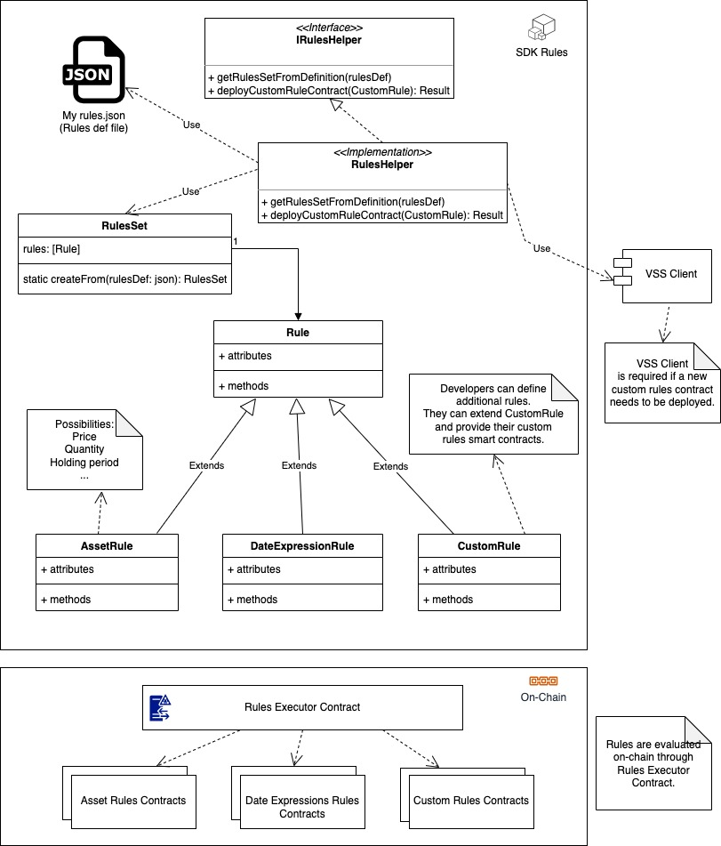
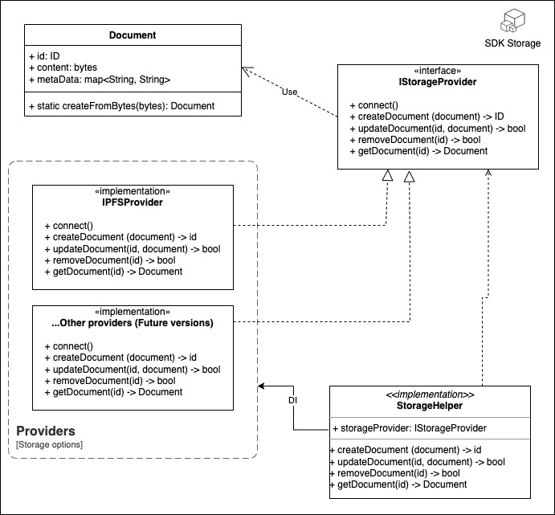
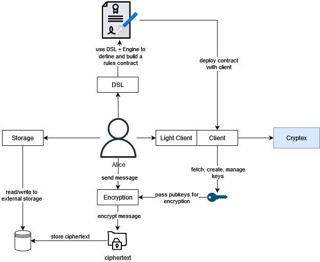

# Cryptex

- **Team Name:** Ideal Labs
- **Payment Address:** 0x0TODO
- **[Level](https://github.com/w3f/Grants-Program/tree/master#level_slider-levels):** 2

## Project Overview :page_facing_up:

**Cryptex** is a blockchain that uses the *blind DKG* protocol. This proposal presents the blind DKG protocol and a potential architecture to implement it within a substrate based blockchain. First, we briefly explain the cryptographic tools and language needed, then we define the main protocol, and finally we propose a potential architecture for an integration of the protocol into a substrate based runtime.

### Overview

Now, suppose Alice has a document that she wants to make available to anybody who can meet some set of rules, but Alice will not be available in the future to hand over the document. Since Alice will not be available, she splits her secret data into pieces, or shares, and gives a single piece to anybody who she thinks will be available later and tells each person some condition that someone should prove to get a share. Then, if Bob appears later and can prove that they have met Alice's rules and enough of the people who have shares believe Bob, then they give a copy to Bob and Bob is able to reassamble Alice's document and read her secret.

This type of sharing is made possible thanks to threshold secret sharing, first introduced by [Shamir](https://web.mit.edu/6.857/OldStuff/Fall03/ref/Shamir-HowToShareASecret.pdf). However, TSS by itself has several issues, namely that it requires a trusted setup for the key generation phase. So, verifiable secret sharing schemes have been developed to allow for the verification of shares (such as [Feldman's scheme](https://www.cs.umd.edu/~gasarch/TOPICS/secretsharing/feldmanVSS.pdf), which ours closely mirrors). The setup, however, still depends on a trusted party to choose who gets to generate the shares. Thus, a distributed key generation protocol is a protocol to generate shares in a trustless way, with no third party needed. 

In this proposal we introduce our protocol, blind DKG. Blind DKG is a distributed key generation protocol where validators are incentivized to participate. Our protocol allows for a verifiable secret sharing scheme with an on-chain proof system to gate access to data. Unlike a traditional VSS scheme, it eliminates the need for a trusted setup by using a distributed key generator, as well as blind selection via a VRF. It allows for a trustless key generation and reencryption (i.e. secret sharing) process. When implemented as part of a decentralized network (such as a blockchain), it enables a system where you can create a distributed secret and derive numerous provably owned (by onchain identity) public keys that can then be used to encrypt data, while the network becomes responsible for reencrypting it. Additionally, we extend the protocol to enable a 'cryptographic gate' to data access, wherein an owner of some data can define rules to delegate decryption rights. The mechanism is both non-interactive, in that Alice does not need to interact with Bob in order to delegate decryption rights, and also has no trusted setup. Alice does not need to trust the set of participants holding the pieces of her secret (nor even know their identitites).

### Project Details

To start, we provide a brief overview of secret sharing and distributed key generation. Then, we will use this to explain the idea for our protocol. For additional motivation and details, we direct the reader to a [substack](https://ideallabs.substack.com/p/blind-dkg-part-1) we wrote that elaborates on the reason that VSS by itself isn't enough for an unstoppable application.

This proposal both extends and reimagines many of the concepts that were part of the [iris](https://github.com/w3f/Grants-Program/blob/master/applications/iris_followup.md) proposal.  

#### Background: Secret Sharing and Distributed Key Generation

##### Secret Sharing

Threshold secret sharing is a cryptographic protocol to encrypt a secret so that it can only be recovered if a threshold of participants participate. To be explicit, it can be thought of as the secret key being split into 'shares' and distributed to a set of shareholders. When a minimum threshold of shareholders reveal their shares, the secret is revealed. The basis of this scheme is thanks to interpolation of Lagrange polynomials. A LaGrange polynomial is any n-degree polynomial of the form $f(x) = \sum_{i=0}^n a_ix^i$ over some field. In a secret sharing scheme, we assume that this polynomial is over a finite field of prime order $q$, with coefficients $a_i \in \mathbb{Z}_q$.

The basis of a TSS protocol is thanks to Lagrange interpolation, which basically says that if you have $n$ points $(x_1, y_1), ..., (x_n, y_n)$, then there is a **unique** polynomial $f(x)$ whose degree is less than $n$ which passes through them. The degree of the polynomial $f$ is what we will mean by the 'threshold'. In a secret sharing scheme, a polynomial of degree $t < n$ is used, where $t$ can be configured as an input parameter.

To share a secret, a polynomial $f$ of degree $t$ can be created, with coefficients randomly sampled over the integers modulo a large prime, and where the first coefficient is the secret to be shared. The polynomial can then be evaluated at $n$ points and each value, or 'share' can be transmitted to a shareholder. Later on, the secret can be recovered when a threshold of the shares that were distributed are collected by reconstructing the polynomial $f$ through interpolation, and evaluating $f(0)$, which is our secret. With this, Alice can distribute the shares among $n$ participants, and later on Bob only needs to collect $t$ shares from them to recover the secret. 

This basic secret sharing scheme can be extended in order to make the distributed shares 'verifiable', in the sense that the recipient of a share can verify if what it received from another participant was truly a share from some polynomial or if it is some other value. This is done by publishing a commitment to the polynomial along with the shares. This type of scheme is called a 'verifiable secret sharing' scheme, and is what we will use in our construction.

##### Distributed Key Generation

By itself, VSS still requires a 'dealer' to generate the secret polynomial $f$ and distribute shares. This places a large degree of trust on the dealer. Also, there is not a clear way to make the sharing of a secret both trustless and non-interactive. To make it non-interactive, a semi-trusted set of  proxies (shareholders) are needed to reencrypt the data. To make it trustless would require that the owner of some data 'sign off' in order to make a secret available to another participant, which provides no clear way to scale. 

Some solutions, such as the Lit protocol, use a similar mechanism, using a DKG to start a TSS process. Additionally, they perform the computations using keys within a TEE. However, in their protocol, each member of the validator set is a shareholder, and so generating new keys is very expensive. I doubt that the network could scale to handle reencryption hundreds of keys within a small timeframe, whereas our solution is highly scalable.

Distributed key generation, or DKG, allows for shares (which can be used in a threshold encryption scheme), to be generated in a trustless way. Our scheme, inspired by the [ethDKG scheme](https://eprint.iacr.org/2019/985), is composed of three major phases: the sharing phase, the disputes phase, and the key derivation phase. During the sharing phase, a subset of the participants, called the dealer set, randomly selects a polynomial and calculates secret key shares for each member of the dealer set (other than itself). Then it encrypts each share for each member of the dealer set and publishes a commitment to the polynomial and the encrypted share onchain. After a dealer shares its generated shares with other dealers, the disputes phase begins, in which dealers prepare zero-knowledge proofs of the invalidity of any shares they are claiming as invalid. If a threshold of dealers believe the proof, then the share is marked is disqualified from the rest of the protocol. Finally, in the key derivation phase, a qualified subset of the initial dealer set is determined and a master public key and secret is able to be determined. 

Once a master public key is known, it can be used to encrypt some secret. Later, through the VSS scheme, the secret can be made available to another participant by 'reencrypting' the shares used for the master public key used and sharing with the other participant. In our network, we will assume that each address has a public/secret keypair associated with it. Thus, by reencryption, we mean that each shareholder decrypts their share, then encrypts it again using some public key (e.g. the pubkey of the address who should receive shares) and publishes it.

#### Our Proposal

Though a DKG scheme might solve the problem of securely generating the keys, it still does not allow for a 'fully decentralizable' protocol. First is the issue of choosing which participants in the network are selected to act as dealers. If this set is centralized or static, then the network is more centralized and less secure. Secondly, assuming that through some mechanism that the set of participants in the DKG are randomly distributed among the available candidates, how can we be sure that the selected participants will be willing to participate in the DKG to begin with? Or if they do, how can we be sure that they will remain online so our secret can be reencrypted later? EthDKG solved this with smart contracts, but contracts provide limited capabilities.

We propose the consensus-backed blind DKG protocol. It enables a *blind* DKG process where participation is incentivized by rewards provided by the network, and shares are secured by the stake of each participant in the DKG protocol. We accomplish the 'blindness' of the protocol this through the use of verifiable random functions in conjunction with zk SNARKs. The mechanisms allows for the formation of 'societies' whose members, each a validator, participated in the DKG process together. Our proposed implementation consists of a standalone 'Blind DKG' library that will compile to wasm, two new pallets to enable blind DKG, and an SDK to interact with the blockchain and external storage systems. Finally, we propose a system similar to that used in the Iris proposal, whereby data access/decryption rights are gated through a smart contract.

##### What this is not
- This protocol does not encrypt or decrypt data for you, only keys. Data encryption and decryption must still be handled outside of the main protocol, though we scope out a user interface that demonstrates how handle that in the browser using the blind dkg library. We will provide a form of encryption through that library, but it isn't the only aglorithm that could be implemented, and anyone could implement their own.
- This protocol is not a decentralized storage solution. The management and storage of data that is encrypted with keys generated this way must still be handled offchain. This protocol will attempt to be storage agnostic.

### Blind DKG Protocol

To begin, our protocol has two main DKG algorithms. The first is among a publicly known validator set, and the second is among a 'blind' validator set.

#### Session Validators and Session Public Key Derivation

In the first phase of the protocol, a fixed amount of *session validators* are selected based on their VRF output. We will be contstructing a (t, n)-VSS scheme among the session validator set, where each session validator has a secret share and they collectively derive a session public key. The idea is that this set of validators can reencrypt data for other validators later on without the sender knowing the identity of the recipient. This forms the basis for the 'blindness' of our ultimate keygen construction, and also ensure that we are given a unique, randomly sampled session public key for each session. At the end of each session, rewards will be calculated and distributed based on session validators' stake and performance during the session. The values for $\tau$ and $\epsilon$ are TBD. but will be well known among all validators.

As an aside: The idea of validators being able to participate in a VSS scheme has been used in [HoneyBadgerBFT](https://eprint.iacr.org/2016/199.pdf) previously, so we may want to explore atomic broadcast in the future. 

1. A session's planning phase begins.
2. Using a commonly known number $\tau$ and $\epsilon$, each validator calculates a random number using a VRF and commits to it. Let $d$ be the VRF output.
3. For the calculated value, $d$, if $|\tau - d| \lt \epsilon$, then the validator can consider itself 'chosen' and begins to participate in the DKG process by generating a secret share, as well as a secret polynomial, commitment to that poly, secret shares, and at this point calculates a public key, $g^{f(0)}$. 
4. When ready, participants publish their proof that their VRF output makes them a session validator and commitments to the polynomial and public key. 
5. When another node *publicly* announces its ability to participate and commits to its poly (i.e. step (3)), then encrypt a secret key share for that identity using its published public key and publish it onchain along with its proper commitment. The encryption scheme used here is TBD, though looking at El Gamal.
6. The validators dispute invalid shares. This is elaborated on [here](#disputes-phase).
7. If a threshold of session validators participate honestly, then a session public key can be calculated.
 

 

#### Ad-Hoc DKG and Secret Societies

Now that the session validators have provided a session public key, we can begin the blind dkg. During each session, a participant can issue a 'request' to start the DKG by providing a number of shares and a threshold, $(t, n)$. Then, 'secret societies' can be formed, wherein each member has a secret key share. The protocol (for a single request) is as follows:

1. A participant issues a request to start the DKG, $(t, n)$
2. Validators can choose to 'bid' on being in the group by generating a VRF output and publishing a commitment to it onchain.
3. If $|\tau - d| \lt \epsilon$, then the validator can consider itself 'chosen' and begins to participate in the DKG process by generating a secret share, as well as a secret polynomial, commitment to that poly, secret key shares. That is, they calculate $\{(F(j), f(j))\}_{j=1}^n$. 

Up until now, this has pretty much been the same as the previous section. But now, we make a change. In order to share the secret key shares, they need to be encrypted. However, since we want to continue to maintain the anonymity of the validators who think they've won, we can't possibly encrypt the shares because we don't have any public keys. This is where the session public key comes in. Instead of encrypting for a specific validator, the keys are encrypted using the session public key.

4. Encrypt each key share using the session public key, generating secret shares $\overline{s_j} := E_{spk}(f(j))$ for $j = 1, ..., n$.
5. Publicly announce the encrypted shares, commitments to the polynomial, and proof that you could participate (proof of VRF output).
6. When other participants announce the information above, the session validator set becomes responsible for agreeing on a slot number for each valid participant. After a maximum number of blocks, the session validators vote and assign slots for each valid participant. 
7. The session validators then verify each of the shares they received, which feeds into the [disputes process](#disputes-phase) as discussed below.
8. Then, session validators act as a 'secret key transport layer', where they each provide a shares for each validator who was assigned a slot in the previous step.. That is, they reencrypt up to $n$ shares that were published by the other members of the secret society.
9.  Finally, each participant receives a set of encrypted key shares that they can then decrypt, derive public keys from, and reencrypt.
10. For a subset of the society that passed the disputes phase, a public key/private key pair can be derived. We elaborate on that [here](#key-derivation).

 

#### Disputes Phase

The disputes phase occurs as a subprocess of both of the above keygen algorithms. When a share is invalid, is must be ejected from the protocol. If an adversary issues an invalid share, then honest participants should issue a dispute against it. In order to ensure an adversary cannot falsely dispute the validity of a share, we place the burden of proving invalidity onto the party issuing a dispute. This is accomplished by using zk SNARKs. There are two flavors of this algorithm that we use. First, among the session validators, and secondly among a secret society.

##### Disputes Phase for Session Validators

The disputes phase for validators is very simple.

1. Since session validators all agree on the same 'group generator', when a session validator receives a share from another validator it can verify if it is a valid share. Each session validator verifies each share it recieves. If a share is valid, then there is no dispute.
2. If a share is invalid, the prepare a (zk) proof that the share is invalid and publish it.
3. If a threshold $t$ of other validators verify the proof, then the share is rejected from the protocol. Here, the identity of the validator who provided a bad share can be publicly announced as well.

At the end of this, if any validator submitted an invalid share we consider them an adversary, and their stake will be slashed.

##### Disputes Phase for Secret Societies

The disputes phase for secret societies is quite a bit different than for session validators. In effect, the society relies on the session validators to ensure the validity of shares that they receive. During the DKG, when a participant proves its valid VRF output to the session validator set, the session validator set will facilitate the disputes process by verifying each share when it is asked to reencrypt it. This functions identically to the disputes phase for session validators.

#### Key Derivation

To derive keys, we use a new group generator $h$. Then, each member of a society generates a public key by calculating $h^s$ for their secret share $s$. Each member also prepares a proof that they calculated their share correctly. For this, we will use a zk proof, possibly using the DLEQ as in EthDKG, or groth16 as in the disputes phase (though DLEQ could be used there as well).

#### Encryption and Decryption using Derived Keys

Initially, we plan on using El Gamal for encryption and decryption. The encryption shceme will be over the same curve as the DKG, so that during the encryption phase the encrypting party only needs to use the derived public key as any normal public key. To decrypt however, we need to reconstruct the private key. To do so, we need to calculate the sum of the secret shares. This might sound difficult: if only a threshold of participants are available, we still don't have enough information to get the private key! But that's where the magic of the DKG comes in play. Since we used a DKG to generate the keys, the entire secret can be recovered by any threshold of participants! So as long as a threhsold is honest, we can always reconstruct the secret key. 

#### Session Changes/New Sessions

For the time being, we will assume that the input and output of the blind dkg must happen within a single session. In the future, we will resolve this issue. 

#### Secret Sharing

After encrypting some data using the public key that you own, and which is emergent from some secret society, you may want to share that information with someone else, identified as another participant in the network. To do so, we need to the secret society to reencrypt the shares for the new participant. In one sense, a secret society is really just any set of nodes who can prove all of their shares came from the same polynomial. So when we need to reencrypt data using this secret society, we really want to issue a 'request' that asks "If you can prove your share came from the polynomial whose commitment is given by $F(x)$, then please reencrypt a key".

So, to enable secret sharing with a secret society, we create a struct, similar conceptually to an NFT, with some associated commitment to a polynomial, $F(x)$, and an owner, the participant who initiated the DKG. By attesting its ownership of the commitment, the owner can issue commands to the network (i.e. via an extrinsic) to both `derive` new public keys and to `reencrypt` secret keys. This is done by issuing a transaction that encodes the commitment, $F(x)$ and rewards any participants who provide a valid share.

Finally, the recipient of the shares can verify each share, rejecting invalid ones, and only rewarding participants who provided a valid share. At this point, the identities of the society are revealed. We will explore 'member rotation' in the future, however, for now we will just assume this is acceptable.

#### Data Access/Decryption Rights Delegation

In this section, we explore several potential ideas that we can implement in order to let the owner of a public key define how access to that public key is defined in terms of the blockchain's state. Ultimately, we would like to make both options available. For the inital version, for sake of time to get a functional product, we will use **smart contracts** as gates to data. In the future, we will use a more sophisticated and privacy preserving approach with zk SNARKs. First, we present our SNARK based idea. Then we explain how we can accomplish a similar goal with contracts.

##### Future state: Using zk SNARKs
Now, we propose an extension to the DKG/VSS mechanism above. In our new construction, we allow the owner of a society to prepare a ZK SNARK to encode a statement in the blockchain's state, for example, using R1CS to encode a requirement for ownership of some specific NFT, or having a minimum balance, etc. This is a publicly verifiable SNARK. Along with the (multi)location if the ciphertext, the encryptor also shares the common reference string (CRS) and the relation used (i.e. the condition in the blockchain's state) to generate the CRS. This is then associated with the public key that encrypted it. For example, a mapping like: $PK \to (R, \sigma, /ip4/.../QmX99dAd...)$. It should be publicly verifiable that an owner 'owns' the public key, but there is no direct mapping between the public key and the society. However, the members of the society are still able to determine if the public key belongs to them.

When a third party, say Bob, wants to get access to some ciphertext, he prepares a merkle proof of his state that he claims meets the conditions defined by Alice. Then, he prepares a zk proof claiming that his Merkle proof satisfies Alice's condition. If a threshold of shareholders can verify this proof, they each reencrypt a share for Bob. After a threhsold are reencrypted, Bob can recover the secret.

##### Proposed state: Using Smart Contracts
Smart contracts can serve as immutable rule sets that , a similar way as was done in Iris. When you create a pubkey, you also provide an address. When a caller requests reencryption, you first check that the given address has authorized it, and then you can provide a share. This option is probably a lot easier than option 1. But, it's not privacy preserving at all.

#### Proposed Architecture

##### Libraries/Tech Stack

- Languages: rust, typescript/javascript
- Frameworks/Libs: substrate + tools (e.g. ink!, zombienet, telemetry), arkworks-rs for algebra and zk SNARKs.
- We will use [tarpaulin](https://github.com/xd009642/tarpaulin) for test coverage of our new pallets and node.

##### Blind DKG Library

This is a standalone library that contains the code for the main blind dkg protocol. We plan on building this using arkworks-rs unless we find a better alternative. This library will enable the Blind DKG protocol as detailed above. In essence, it will provide functionality to:

- generate secret shares, commitments
- verify key shares and prepare proofs of correctness of invalidity
- encrypt and decrypt key shares using the curve used by the dkg 
- encrypt plaintext using El Gamal (wasm)
- restructure a secret key and decrypt ciphertext via el gamal (wasm)

The library will also compile to wasm. We do this so that the encryption and decryption functionality can easily be called within the browser. Additionally, we would like to use the curves defined in the [ark-substrate](https://github.com/paritytech/ark-substrate) library.

##### Pallets

These pallets may rely on other pallets that already exist in FRAME, which we don't mention here. (e.g. Grandpa, Babe, Balance, Timestamp, etc.).

###### DKG  Pallet

The DKG pallet will be responsible for:
- electing session validators 
- session validator DKG and session public key derivation
- ad-hoc dkg (blind dkg)

The pallet will be heavily inspired by the substrate [staking pallet](https://github.com/paritytech/substrate/blob/master/frame/staking/README.md). We will assume a static number of session validators for now. Similar to the staking pallet, we will use the [election-provider-multi-phase](https://github.com/paritytech/substrate/tree/master/frame/election-provider-multi-phase) crate to choose the session validator set. The election provider operates in two phases, a signed phase and an unsigned phase, where the unsigned phase happens offchain and only allows validators to participate. The signed phase ends when the `elect` extrinsic is called. During our signed phase, validators will calculate the output of their VRF and submit a commitment to it onchain. Then, in the unsigned phase, each validator that thinks it met the conditions to partiicpate, starts the dkg process, generating secret shares, commitments, etc. and publishes the information an unsigned tx (essentially an inherent). We will make use of this election provider for both the session validator selection and the ad-hoc dkg. 

###### SNFT Pallet

This pallet enables the onchain representation of public keys derived through blind DKG.

We use an approach similar to a [DID](https://www.w3.org/TR/did-core/) to allow the public keys created as part of the derivation phase of the VSS as unique, ownable, usable onchain entities. We could also consider this as some special kind of NFT, so we call it an SNFT (s for secret). The owner of the public key is able to request a decryption key at any time. Further, this pallet will allow the owner, or an authorized proxy, to temporarily (or permanently) provision access to other addreseses to request key shares from the network (like temorary delegate for a DID).

##### SDK
We will build an SDK with the following capabilities to allow developers and protocols to interact with cryptex:
  - **Encryption:** provides types and functions to encrypt and decrypt secrets. This functionality will rely on the wasm build of the [blind dkg library](#blind-dkg-library).
  - **VSS Client:** provides types and functions to interact with the protocol, some examples of such interactions are encryption key requests and secret sharing requests. We will build this with either polkadotjs or [Capi](https://github.com/paritytech/capi). It contains the calls needed to interact with the DKG pallet for key generation and the SNFT pallet for reencryption and for delegating decryption rights to other identities. This module also provides support for interacting with smart contracts (maybe with [use ink](https://github.com/paritytech/useink)). We would also like to explore using a light client, and potentially delve into [mobile compatibility](https://github.com/paritytech/trappist-extra).
  - **Rules DSL:** a domain specific language to define/model access rules required to get access to  a shared secret. Once defined, rules are packaged/translated to smart contracts. In future versions we will build a graphic editor to define these rules using our DSL as building block. The following diagram shows a high-level conceptual design of this capability:
  
  

    
  

  - **Storage:** provides types and functions to save/read/update ciphered documents through different datasource options. The first version will provide IPFS as data storage option but we are going to expand this module in the future to include centralized options as well such S3, Google Drive, between others. We will use a `MultiAddress` to locate data and a `CID` to identify it. The following diagram shows a high-level conceptual design of this capability:
  
  

    
  

  - **Graphql API:** provides types and functions to fetch data saved on-chain and off-chain related to Blind DKG in a developer friendly way. We may also explore the usage of [subquery](https://subquery.network/). This may not be in scope of the current grant.

From a user-centric perspective, the basic vision for the architecture needed to build a dapp on cryptex might look something like this.

 

Dapps built on the protocol would essentially be 'multiaddress and CID management' contracts which would be responsible for storage and curation of the multiaddresses and CIDs that are encrypted with some given public key. For example, a 'Netflix' dapp might look like some type of decentralized database mapping CIDs to some set of metadata (e.g. title, genre, rating), where the CIDs point to data encrypted with the Netflix public key generated via the DKG. The 'Netflix Rules' contract could be something as simple as checking if the caller owns the official 'Netflix NFT'. Dapps will most likely need to rely on some type of storage beyond what's available in the contract, as contract storage is limited and this data could potentially be huge. We leave the storage solution up to the implementer here via the storage module within the SDK. We intend to make this modular enough for a data owner to use any type of storage they choose, though to begin we limit this to only IPFS.

### Ecosystem Fit

Help us locate your project in the Polkadot/Substrate/Kusama landscape and what problems it tries to solve by answering each of these questions:

- Where and how does your project fit into the ecosystem?
  - Our project is a substrate-based chain that introduces new capabilities to the ecosystem.
  - Our work will produce tools and knowledge that will be open source and openly available to the developer community.
  - We aim to become a parachain.
- Who is your target audience (parachain/dapp/wallet/UI developers, designers, your own user base, some dapp's userbase, yourself)?
  - **parachain**: ultimately, we strive to become a parachain. By taking advantage of XCM and continuing to evolve the cryptographic mechanisms surrounding delegation of decryption, we believe that very powerful and dynamic paradigms can be unleashed, such as gating access to data based on conditions of any state in any other parachain (e.g. data access via ownership of some specific asset on Statemint).
  - **users**: A long-term target audience will be our own user-base, as well as the user base of other parachains who need to share a secret. 
  - **Developers**: The tools we develop will be open source and available to other developers in the ecosystem. We intend to build a robust toolkit to enable devs to easily build on our new protocol/blockchain.
- What need(s) does your project meet?
  - Our project enables a decentralized an unstoppable secret key custodian. We see this as a foundational layer to building decentralized 'cryptographic data ownership' models, where by having a trustless key custodian, the network allows you to provably 'own' data, by proving that you own the keys to decrypt it. We think that this is a very powerful ownership model that can disrupt how data is secured today.
  - On top of that, the project also allows for a certain degree of governance within the system, and we have plans to add some type of 'decentralized moderation' tools in the future. 
- Are there any other projects similar to yours in the Substrate / Polkadot / Kusama ecosystem?
  - There are some projects that use threshold encryption:
    - [CESS](https://cess.cloud/)
    - [SkyeKiwi](https://github.com/skyekiwi/skyekiwi-protocol)
    - However, neither project uses a dkg for trustless keygen as we do. Further, SkyeKiwi is dependent on IPFS, which our protocol is not.
  - If so, how is your project different?
  - If not, are there similar projects in related ecosystems?
- We have found projects that are similar in other ecosystems as well:
  - For general "password manager/storage" type applications, we have:
    - [b.lock](https://github.com/BlockProject/b-lock)
    - [DaPassword](https://cardano.ideascale.com/c/idea/332494)
    - [Blockchain password](https://margatroid.github.io/blockchain-password/#/)
    - [You](https://medium.com/airgap-it/you-the-decentralized-password-manager-2f521cced7be)
  - [EthDKG](https://github.com/PhilippSchindler/EthDKG): Our protocol uses the same DKG scheme as ethDKG, though we use a different SNARK system and have several other distinctions (e.g. consensus-backed security for secret shares).
  - [Share](https://share.formless.xyz/): which appears to use some type of threshold encryption but does not go into major detail (and which has dubious scalability)
  - [Lit Protocol](https://litprotocol.com/): We share many similarities with this protocol as it is built on the same underlying technology, using DKG and TSS. However, lit only enables on layer of TSS, similar to our 'session public key'. Additionally, it does not use zk SNARKs or other privacy preserving tools. I believe that Lit would not scale well, whereas this protocol does. 

## Team :busts_in_silhouette:

### Team members

- Tony Riemer
- Carlos Montoya
- Juan Girini

### Contact

- **Contact Name:** Tony Riemer
- **Contact Email:** driemworks@idealabs.network
- **Website:** https://www.idealabs.network/

### Legal Structure

- **Registered Address:** 2451 Crystal Drive, 6th floor, Arlington, VA 22202, USA
- **Registered Legal Entity:** Ideal Labs, LLC

### Team's experience

Please describe the team's relevant experience. If your project involves development work, we would appreciate it if you singled out a few interesting projects or contributions made by team members in the past. 

If anyone on your team has applied for a grant at the Web3 Foundation previously, please list the name of the project and legal entity here.
Tony has worked on two, [here as "iridium"](https://github.com/w3f/Grants-Program/blob/master/applications/iris.md) and [here as "Ideal Labs"](https://github.com/w3f/Grants-Program/blob/master/applications/iris_followup.md).

### Tony Riemer

I am an engineer and math-lover with a passion for exploring new ideas. I studied mathematics at the University of Wisconsin and subsequently went to work at [Fannie Mae](https://en.wikipedia.org/wiki/Fannie_Mae) and then [Capital One](https://en.wikipedia.org/wiki/Capital_One), where I mainly worked on fintech products, like systems for loan servicing and efficient pricing algorithms. For the previous year and a half, I've been working exclusively in the web3 space, including having worked on two web3 foundation grants [here](https://github.com/w3f/Grants-Program/blob/master/applications/iris.md) and [here](https://github.com/w3f/Grants-Program/blob/master/applications/iris_followup.md). Beyond that, I have dabbled in many open source projects as well as have built several of my own, ranging from computer vision, machine learning, to blockchains and IoT.  Most recently, I attended the Polkadot Blockchain Academy in Buenos Aires, and this new proposal is an application of ideas I learned there applied to my previous grant.

### Carlos Montoya
I have been doing software for more than 20 years now, most recently in the startup world. 
- **Blockchain Experience**
Through 2022 I was mainly focused on building smart contracts with solidity and took part in some encode-club boot camps and ETH Global hackathons. I built several apps, one of them a decentralized job-board app and protocol called [web3Jobs](https://ethglobal.com/showcase/web3jobsfevm-inz64) ([Repo](https://github.com/encode-g2-project)). In Early 2023 I participated in the Polkadot blockchain academy in Buenos Aires, and Cryptex's idea emerged.
- **Software Engineering Experience**
  Since early 2021 I have been building [TeamClass](https://www.teamclass.com) as CTO and partner. TeamClass is a b2b marketplace for helping companies with their team-building initiatives through virtual events. We bootstrapped TeamClass ourselves and made sales by 3.8M in our first year. Previously, between 2016 and 2020 I was completely focused on building [StellarEmploy](https://www.stellaremploy.com) with my co-founders, where we had the opportunity to participate in NY ERA (Accelerator), and got institutional capital. StellarEmploy's technology was recently acquired by Learning Collider. Finally, between 2004 and 2015, I was CTO and Chief Architect at [MVM Software Engineering](https://www.mvm.com.co/?lang=en), a technology firm with a deep focus on energy solutions. During my time there I had the responsibility of defining the way of doing software for the entire company, leading very skilled people, building complex software products, and managing hundreds of initiatives for helping the company to expand its operations in Colombia, the Dominican Republic, and Mexico. 
  
  
**Education**
  - **Carnegie Mellon University**
    Master of Science Information Technology, 2011 - 2013
  - **Tecnológico de Monterrey**
    Master in Information Technology Management, 2011 - 2013
  - **Universidad Pontificia Bolivariana**
    Innovation and Technology Management, 2009 - 2010
  - **Universidad Autónoma de Manizales**
    Systems Engineer, 1997 - 2002

### Juan Girini

 I am a software engineer with nearly 20 years of experience. Over the years, I have worked in various industries and have gained valuable experience in backend projects for the web2 space. However, my passion for decentralization has led me to focus on web3.

I studied Information Systems Engineering at [Universidad Tecnológica Nacional](https://utn.edu.ar/) in Argentina. In early 2023, I graduated from the Polkadot Blockchain Academy in Buenos Aires. This life-changing experience opened doors for me into the world of Substrate. During my time at the academy, I had the opportunity to meet with Carlos and Tony. Together, we started to conceive this project.

Following my graduation from the academy, I joined Parity as a Core Rust Engineer in the Pallet Contracts team. Some of my previous working experiences are Backend Developer at [Scayle](https://www.scayle.com/); Lead Engineer at [Cohabs](https://www.cohabs.com/); and Head of Development at [Barracuda Digital](https://barracuda.digital/).

### Team Code Repos

- https://github.com/ideal-lab5/cryptex-node
- https://github.com/ideal-lab5/blind-dkg
- https://github.com/ideal-lab5/contracts

Please also provide the GitHub accounts of all team members. If they contain no activity, references to projects hosted elsewhere or live are also fine.

- https://github.com/driemworks
- https://github.com/carloskiron
- https://github.com/juangirini

### Team LinkedIn Profiles

- https://www.linkedin.com/in/tony-riemer/
- https://www.linkedin.com/in/cmonvel/
- https://www.linkedin.com/in/juan-girini/

## Development Status :open_book:

If you've already started implementing your project or it is part of a larger repository, please provide a link and a description of the code here. In any case, please provide some documentation on the research and other work you have conducted before applying. This could be:

- academic publications relevant to the problem
  - our main dkg protocol is inspired by [EthDKG](https://eprint.iacr.org/2019/985).
  - the idea of the validator set participating in the reencryption of shares is inspired by [Honeybadger BFT](https://eprint.iacr.org/2016/199.pdf). Our network does not achieve atomic broacast at this time, but it is a future avenue we would like to explore. 
  - [Some further reading on VSS and DKG protocols](https://eprint.iacr.org/2012/377.pdf)
- links to your research diary, blog posts, articles, forum discussions or open GitHub issues,
  - I have already started a PoC to implement the blind dkg protocol here: https://github.com/driemworks/dkg
  - I have started on a whitepaper. [The draft can be found here](https://drive.google.com/file/d/1iouXfgJ7mMpwtfJrFTuaNnhy3R8oATPz/view?usp=sharing). We plan to complete it during the duration of this grant.
  - This work builds on the previous work done by Tony in his Iris project (see previous w3f grants).
  - I've started a substack to explain the protocol and document its development. Part 1 is published here: https://ideallabs.substack.com/p/blind-dkg-part-1
- references to conversations you might have had related to this project with anyone from the Web3 Foundation
  - We have spoken with several individuals involved with the grants program and with square one, specficially Coleman Maher and Nico Morgan, in a non-technical capacity, to discuss the high-level idea and potential. 
  - During an evaluation of the Iris grant, I spoke with the evaluator Diego and he expressed scepticism around the security of the approach taken in Iris. While attending the PBA, after discussing secret sharing ideas with instructors and other engineers at Parity and becoming more well-versed in cryptography, I was able to reimagine the secret sharing implemented in Iris and redesign the system in order to fix the vulnerabilities inherent in the approach, and to make it truly 'unstoppable'. I have shared this idea as well as the draft whitepaper with several parity engineers as well, though that is not a formal review of it.

## Development Roadmap :nut_and_bolt:

### Overview

- **Total Estimated Duration:** 20 weeks
- **Full-Time Equivalent (FTE):**  2.5 FTE
- **Total Costs:** 72,000 USD

### Milestone 1 — Session Validator DKG

- **Estimated duration:** 5 weeks
- **FTE:**  2.5
- **Costs:** 18,000 USD

Goals:
- TSS Library development and testing
- Basic session validator set creation and session public key derivation
- Beginnings of SDK: encryption, decryption, IPFS interactions
-- 
- we omit the disputes phase until milestone 3

| Number | Deliverable | Specification |
| -----: | ----------- | ------------- |
| **0a.** | License | Apache 2.0 / GPLv3 / MIT / Unlicense |
| **0b.** | Documentation | We will provide both **inline documentation** of the code and a basic **tutorial** that explains how a user can (for example) spin up one of our Substrate nodes and send test transactions, which will show how the new functionality works. |
| **0c.** | Testing and Testing Guide | Core functions will be fully covered by comprehensive unit tests to ensure functionality and robustness. In the guide, we will describe how to run these tests. |
| **0d.** | Docker | We will provide a Dockerfile(s) that can be used to test all the functionality delivered with this milestone. |
| 0e. | Article | We will publish an **article**/workshop that explains [...] (what was done/achieved as part of the grant). (Content, language and medium should reflect your target audience described above.) |
| 1. | (2 weeks) Library: DKG | We implement and test a DKG protocol implemented with arkworks (unless we find a better solution). The first version of the protocol will have abilities to generate a key/poly, commit to it, to encrypt secret shares (for transmission) and to decrypt them (the combination of these two enables reencryption). This will be the main library we integrate into our runtime to enable the dkg. We will experiment with a few potential curves, specifically BLS12-381 and BLS12-377 (among others). There is some learning that will be needed as part of this. |
| 2. | (2 weeks) Substrate module: DKG Pallet | We build a pallet to enable the system mentioned [here](#session-validators-and-session-public-key-derivation) minus the disputes phase. Under the hood, we will use Babe and Grandpa for authorship and finalization, and this pallet will be based on the [staking pallet](https://github.com/paritytech/substrate/blob/master/frame/staking/README.md). We will use the same VRF that is used by BABE. |
| 3. | (2 weeks but done in parallel) SDK | Setup encryption and decryption capabilities, setup capabilities to interact with IPFS to add/read data. In terms of the [breakdown above](#sdk), this is development of the storage and encryption modules. |

### Milestone 2 — Ad-Hoc DKG/Secret Societies

- **Estimated Duration:** 5 weeks
- **FTE:**  2.5
- **Costs:** 18,000 USD

Overview: At the end of this milestone, we will have a functional decentralized 'secret recovery' network, wherein an address can initiate the dkg, own a derived public key, encrypt data with it, request a reencryption key, and use that to decrypt the data.

Goals:
- Ability to perform ad-hoc DKG and derive a public key
  - Use session public key to securely transmit shares
- Ability to use public key to encrypt data
- Ability to decrypt data by getting a decryption key from the society
- At the end of this milestone, we should have basic (though not very secure) functionality to generate a new public key using the dkg, encrypt data with it, then get a reencryption key from the network and decrypt the data.
--
- no disputes phase (milestone 3)
- no secret sharing

| Number | Deliverable | Specification |
| -----: | ----------- | ------------- |
| **0a.** | License | Apache 2.0 / GPLv3 / MIT / Unlicense |
| **0b.** | Documentation | We will provide both **inline documentation** of the code and a basic **tutorial** that explains how a user can (for example) spin up one of our Substrate nodes and send test transactions, which will show how the new functionality works. |
| **0c.** | Testing and Testing Guide | Core functions will be fully covered by comprehensive unit tests to ensure functionality and robustness. In the guide, we will describe how to run these tests. |
| **0d.** | Docker | We will provide a Dockerfile(s) that can be used to test all the functionality delivered with this milestone. |
| 0e. | Article | We will publish an **article**/workshop that explains [...] (what was done/achieved as part of the grant). (Content, language and medium should reflect your target audience described above.) |
| 1. | Library: DKG | We make any changes as needed. There should be none, but you never know with these things. |
| 2. | (1.5 weeks) Substrate module: DKG Pallet - ad-hoc dkg | We extend the functionality of the DKG pallet to submit requests to start the [ad-hoc dkg](#ad-hoc-dkg-and-secret-societies) process and to enable a 'bidding' phase where validators can calculate a VRF output and participate in the DKG as above. The derived public key will be encoded on chain. |
| 3. | (2 weeks) Substrate module: DKG Pallet - share transmission | We implement an encryption mechanism so that validators can encrypt shares using the session public key. Further, we add functionality wherein validators are incentivized to reencrypt these shares correctly when asked (this enables the transmission of the share). Finally, we add functionality so that the receiving validator is able to decrypt the share. |
| 4. | (1 week) Substrate Module: SNFT Pallet | We develop the SNFT pallet to represent ownership of public keys onchain. This pallet will allow the owner or an authorized delegate/proxy to request secret key shares from a society. |
| 5. | (2 weeks but done in parallel) SDK | We design and implement the **VSS module** of our SDK. We integrate with the blockchain and enable users to initiate the dkg process by submitting a threshold and shares value to the dkg pallet. Users should be able to view their public keys created via the dkg, as well as be able to encrypt data with those public keys and to request decryption keys from the network. |

### Milestone 3 - zkSNARKs and Disputes Phase
- **Estimated Duration:** 5 weeks
- **FTE:**  2.5
- **Costs:** 18,000 USD

* note: Milestones 3 and 4 can potentially undergo parallel development. This milestone is purely related to development of core pieces of the protocol, particularly the disputes phase.

Goals:
- implement the disputes phase for session validators and societies
- use zk SNARKs to encode the proof of correctness of disputed shares
- implement economic incentives to participate honestly in DKG (slashing + rewarding)

| Number | Deliverable | Specification |
| -----: | ----------- | ------------- |
| **0a.** | License | Apache 2.0 / GPLv3 / MIT / Unlicense |
| **0b.** | Documentation | We will provide both **inline documentation** of the code and a basic **tutorial** that explains how a user can (for example) spin up one of our Substrate nodes and send test transactions, which will show how the new functionality works. |
| **0c.** | Testing and Testing Guide | Core functions will be fully covered by comprehensive unit tests to ensure functionality and robustness. In the guide, we will describe how to run these tests. |
| **0d.** | Docker | We will provide a Dockerfile(s) that can be used to test all the functionality delivered with this milestone. |
| 0e. | Article | We will publish an **article**/workshop that explains [...] (what was done/achieved as part of the grant). (Content, language and medium should reflect your target audience described above.) |
| 1. | (2 weeks) Library: DKG | We implement functionality to verify/unverify secret key shares. Additionally, we will use [groth16](https://github.com/arkworks-rs/groth16) to prepare a zero knowlede proof when a share is calculated as invalid. |
| 2. | (3 weeks) Substrate module: DKG Pallet: Session Validator Disputes Phase | We implement the disputes phase as detailed [here](#disputes-phase). We integrate the changes made as part of (1) in order to verify shares and construct proofs of their invalidity that can be shared with the network. We also implement the verification of these proofs. We do this using the arkworks [r1cs library](https://github.com/arkworks-rs/r1cs-std). We will intend to address slashing and rewards as part of this phase as well. |
| 3. | (1 week) Substrate module: DKG Pallet: Secret Society Disputes Phase | We implement the disputes phase for societies as detailed [here](#disputes-phase-for-secret-societies). |

### Milestone 4 - Decryption Delegation via Asset Ownership
- **Estimated Duration:** 5 weeks
- **FTE:**  2.5
- **Costs:** 18,000 USD

Goals:
- enable a rule based system to determine if an address can decrypt data
- develop and test a set of contracts to act as a base rule set
- develop tools to define and deploy these rules using a DSL
- showcase features and capabilities of everything developed thus far by building a dapp

| Number | Deliverable | Specification |
| -----: | ----------- | ------------- |
| **0a.** | License | Apache 2.0 / GPLv3 / MIT / Unlicense |
| **0b.** | Documentation | We will provide both **inline documentation** of the code and a basic **tutorial** that explains how a user can (for example) spin up one of our Substrate nodes and send test transactions, which will show how the new functionality works. |
| **0c.** | Testing and Testing Guide | Core functions will be fully covered by comprehensive unit tests to ensure functionality and robustness. In the guide, we will describe how to run these tests. |
| **0d.** | Docker | We will provide a Dockerfile(s) that can be used to test all the functionality delivered with this milestone. |
| 0e. | Article | We will publish an **article**/workshop that explains [...] (what was done/achieved as part of the grant). (Content, language and medium should reflect your target audience described above.) |
| 1 .| (1 week) Substrate Module: SNFT Pallet | We modify the SNFT pallet so that an owner of a pubkey and specify a contract address that needs to be invoked to get access to data. This will look like the contract being set as a 'proxy' for the SNFT, and being able to temporarily delegate decryption rights to other addresses. When an account is a delagate, they can request decryption keys from the network and the society is incentivized to provide them. | 
| 2 .| (1 week) Assets and Chain Extensions | We add the assets pallet to our runtime and expose a chain extension to read the state of the asset balance in a contract. This will power our initial use case, where data access is gated by ownership of an asset. | 
| 2. | (.5 weeks) Contracts | We will work off of the contract [here](https://github.com/ideal-lab5/contracts) developed as part of Iris.  |
| 3. | (2 weeks) SDK: DSL | We design and implement the DSL module of our SDK and enhance the VSS Module in order to ensure smart contract support. This DSL module will allow users to design rules and deploy them as a contract, which can then be associated with their public key via the snft pallet. |
| 4. | (2 weeks) SDK: Generic Secret Sharing Dapp | The final task of the final milestone is to use everything that has been developed thus far and to build a dapp on top of it. Our inital dapp will be a simple secret sharing platform.  We will build an interface that lets users create secrets, store them, define rules for access, share secrets, etc. We want this experience to showcase the full feature set that we have developed. |
...

## Future Plans

Please include here
- Short term intentions include: completion, review, and publication of our whitepaper, building an online presence, releasing cryptex as a testnet, promoting the protocol and SDK, enhancements and continued development, etc.
- Long Term:
  - We would like to become a parathread or parachain on Polkadot (probably parathread initially), which makes the next point more interesting.
  - We would like to explore the usage of XCM in order to accomplish cross-chain 'data locks', wherein the proof of a condition on chain A (e.g. owning some specific asset on Ajuna) would equate to decyryption rights being granted in Cryptex.
  - We would like to explore enabling a threshold signature scheme using the derived keys.
  - We may investigate using an atomic broadcast approach, as in honeybadger BFT.
  - We would like to explore the usage of witness encryption within a blockchain. Some initial research has been done on this and it is a very promising concept, though a practical implementation would be very difficult at this point.

## Additional Information :heavy_plus_sign:

**How did you hear about the Grants Program?** Web3 Foundation Website / Medium / Twitter / Element / Announcement by another team / personal recommendation / etc.
- Tony initially heard about this a year ago via the substrate website. Collectively, we all learned about this at the polkadot blockchain academy.

Here you can also add any additional information that you think is relevant to this application but isn't part of it already, such as:

- As stated previously, Tony has worked on two grants previous to this one. The items in this grant are very much inspired by the Iris grant, however, it is intended to fix all of the vulnerabilities and issues (i.e. lack of scalability) that Iris failed to do.
