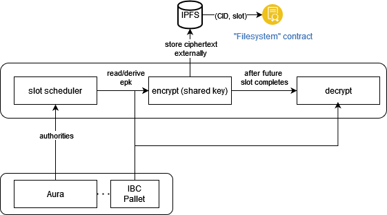

# EtF Network with Aura 

- **Team Name:** driemworks
- **Payment Address:** 0xTODO
- **[Level](https://github.com/w3f/Grants-Program/tree/master#level_slider-levels):** 1

## Project Overview :page_facing_up:

This is an EtF (encryption-to-the-future) network based on Aura. This proposal adds identity based signatures (IBS) block seals to Aura and enables an EtF network, wherein messages can be encrypted 'to a slot' in the future.

### Overview

Cryptex is blockchain that uses a modified Aura that seals blocks using identity based signatures (BLS). We then implement an encryption-to-the-future (EtF) scheme, where messages can be encrypted for arbitrary slots in the future. Our proposal consists of a runtime, which modifies Aura and introduces a new pallet to enable the identity based cryptosystem (IBC), a light client and an SDK, which handles synchronization with the blockchain, slot scheduling, and offchain encryption and decryption functionality.

Being the first EtF network in the ecosystem, Cryptex introduces several new cryptographic primitives which would be useful to others as well. By developing EtF capabilities, other networks can likewise benefit from EtF-based consensus. This proposal lays the foundation for a more robust system later on, using a proof of stake consensus (Sassafrass) and more sophisticated cryptographic primitives for EtF, such as [McFly](http://fc23.ifca.ai/preproceedings/189.pdf) or based on [commitment witness encryption ](https://eprint.iacr.org/2021/1423.pdf). An EtF network can enable randomness beacons, sealed-bid auctions, and non-interactive secret sharing.

We want to build more extensive and secure decentralized data tools, for which this proposal lays the foundation. We believe that the internet is a better place when it's more fair for all.

### Project Details

The major pieces:
1. [IBS Block Seal](#ibe-block-seal-in-aura)
2. [Encryption-to-Future](#encryption-to-future-slots)
3. [User Agent](#light-client)

#### What this is not
- this does not use a proof of stake consensus. For the scope of the proposal, we are assuming a static, well defined validator set using PoA consensus based on Aura. 
- the proposal does not highlight any specific privacy preserving tools nor does it use threshold signatures or any specific MPC protocols 
- most of that is scoped for the future though

#### Notation and Terminology

For the following, assume that we are using curve BLS12-381. As such, we will refer to its scalar field using $\mathbb{Z}_p$ where $p$ is the modulus for BLS12-381. Similarly, we have the pairing friendly elliptic curve groups $\mathbb{G}_1$ and $\mathbb{G}_2$.

#### IBS Block Seal in Aura

The goal of this is to introduce an IBE BLS block seal in Aura, where each slot has a unique role associated with it that we can encrypt to. We 

##### Overview

https://docs.rs/sc-consensus-aura/latest/sc_consensus_aura/

For simplicity, our network will use Aura for consensus. In the future, we intend to migrate to [Sassafrass](https://eprint.iacr.org/2023/031.pdf). For now, we assume that there is a static set of validators defined on network genesis. In Aura, each validator defined in the validator set authors a block in sequential (round robin) order. We will create a fork of Aura, wherein blocks are sealed using identity based signatures, where each slot has a role associated with it.

More concretely, let $A = \{A_1, ..., A_n\}$ be the well defined set of authorites. For now, we'll assume that this set is static. In Aura slots are divided into discrete slots of $t$ seconds each. For any slot $s$, the winner of the slot is determined by $A[s\;\%\;|A|]$, where $A$ is the set of authorities defined on genesis. Note that this implies, in most cases, that a validator will author more than one block during an epoch.
  
- **Identity Based Cryptography**
  Identity Based Cryptography (IBC) was first introduced by [Shamir in 1984](https://link.springer.com/content/pdf/10.1007/3-540-39568-7_5.pdf). Since then, there has been significant research into IBC, I present an overview to the reader [here](https://csrc.nist.gov/csrc/media/Presentations/2023/stppa5-ibe/images-media/20230209-stppa5-Dan-Boneh--IBE.pdf). A complete IBC consists of six algorithms: `Setup, Keygen, Encrypt, Decrypt, Sign, Verify`. Our network will leverage the sign and verify functionalities to seal and verify blocks, and will use the encrypt and decrypt functionalities to enable encryption-to-future-slots.

---
We provide an overview of how the IBC can be used in the context of our blockchain using Aura. Let $H$ be the hash-to-G2 function.

- **Genesis/Setup**

  1.  (standard stuff) Each validator generates a private key and public key for the underlying signature scheme of the blockchain. Theoretically this could be implemented on any scheme, but we use BLS12-381. Each $A_i \in A$ generates keys $(sk_i, pk_i)$, storing the secret key $sk_i$ securely (in their [keystore](https://paritytech.github.io/substrate/master/sp_keystore/trait.Keystore.html)), with the public keys used to define the initial validators. 
   
  2. We define system parameters on genesis:
    - Randomly select some $x \in \mathbb{Z}_p$, the 'master key'. For now, we will assume that this value is static and only defined on genesis. 
    - Choose a generator $P \in \mathbb{G}_1$, then calculate $Y = xP$ and encode $(P, Y)$ in the genesis block.
    - On genesis: Assume that each authority knows the master key, which has been distributed offchain. Later on we will replace this with a more decentralized MPC protocol.

- **KeyGen and Identity**
  Each slot in any given epoch has a unique role associated with it, which is calculated from the slot schedule. For any given address, epoch, and slot number, we calculate a unique role by hashing the address, epoch, and slot number. Later on when encrypting, we will use this value to verify signatures. That is, the public key is $Q_i = H(ID_i = (A_i || e_k || sl_r))$.

- **Block Sealing**
  The winner of a slot $s$ calculates a secret key corresponding to $Q_i$ and uses it to sign the block. They calculate a secret key by choosing a random $r \in \mathbb{Z}_p$ and calculating $xQ_i$. We can calculate signatures as $S = x Q_i + r H(M)$ and $T = r P$, where $<S, T>$ is the signature where $M$ is the block hash.

- **Validation**
  When other nodes import the block, they validate it by  calculating the ID for the slot and calculating the public key $Q_i$ and verifying the signature. We verify the signature by checking the pairings: $e(S, P) = e(Q_i, Y) \cdot e(H(M), T)$

##### Implementation Details

In order to implement an IBE block seal in Aura, we need to:

- Develop a new pallet to enable the identity based cryptosystem to store, submit system parameters

- randomness will be provided by [insecure-randomness-collective-flip](https://github.com/paritytech/substrate/blob/master/frame/insecure-randomness-collective-flip/README.md)

- Key Derivation Function
  - Ephemeral public keys are derived from publicly available information. When the epoch randomness is known (and slot winners can be calculated), the ephemeral public keys of slot winners are calculated and encoded on-chain when the session starts. 

- Secret Key Derivation + Sealing blocks
  - slot winners can derive their secret key prior to sealing a block:
  - https://github.com/paritytech/substrate/blob/252156d9006ee45eda09ab80f687c066f2f4eaac/client/consensus/aura/src/standalone.rs#LL131C2-L131C2

#### Encryption-to-Future-Slots

##### Overview

We propose an Encryption-to-Future (EtF) scheme on top of the modified Aura consensus proposed above.

The high level idea is that given a duration of time, $t$, we can identify a 'slot seed', a role to which we can encrypt a message such that it will be decryptable after time $t$ passes, when the corresponding secret will be published. We accomplish this by:
  - Given a duration $t$ from the current slot, calculate a future epoch and slot which will be active when that time occurs. Then, based on the order of the authorities, we calculate the slot seed. 
  - Encryption and Decryption: we follow the same approach taken in [Boneh-Franklin IBE](https://crypto.stanford.edu/~dabo/papers/bfibe.pdf) for both encryption and decryption. Both actions will occur in an offchain context. Decryption will be possible as soon as the slot winner publishes the block, which will contain the secret key as plaintext.

As can be seen, it will be paramount that all participants agree on the same 'time'.

##### Implementation Details

Since all of this functionality should happen outside the context of a runtime, we implement this as a specialized light client based on [smoldot](https://github.com/smol-dot/smoldot). 

###### Slot Scheduling
 
  As mentioned above, the idea is that we can take some arbitrary time in the future, $t_{fut}$, and identify a slot and epoch when that future time is expected to occur (assuming persistent liveness of the network). Very roughly, our approach will be similar to the following:
  
  If we assume that the current slot index is $sl_{prev}$ and the epoch is $e_k$, then we allow slots to be schedule starting from the next slot in the queue, $sl_{curr}$. Given that each slot lasts a static amount of time, say $t_{slot} \; sec/slot$, we can calculate the slot number $t$ seconds in the future with $sl_{fut} = ((t / t_{slot}) \% s) +1$ where $s$ is the number of slots per epoch. We can then identify the slot winner by calculating $A[{fut}\; \% \; |A|]$, and thus the ID. The authority slot assignments will be provided to the user from a light client, with calculations of slot seeds occuring within the SDK. 

###### Encryption-to-future-slots (EtF)

  Assuming that we have found an ID for a future slot $sl_{fut}$, we now want to encrypt for that slot. To do so, we use El Gamal to encrypt a message using the public derived from the slot seed. The ciphertext can be stored offchain with a reference to it published on-chain (in a pallet or contract) by calculating its sha256 hash, for example. In the future, we will replace this flavor of encryption with a more elegant solution (e.g. some type of witness encryption).

###### Decryption

When a slot winner's slot is active, they derive a secret key which they then use to seal the block. Additionally, the derived secret key can also be used to decrypt any messages that were encrypted for this slot. When the slot winner publishes a block, it also publishes its newly derived secret key. Decryption can then occur offchain using El Gamal.

#### High Level Architecture

We propose the architecture of the system at a high level. It consist of three pieces:
- **blockchain**: The PoA blockchain with IBS block seals. It is a substrate based runtime with a new pallet that enables the identity based cryptosystem along with our modifications to Aura.
- **user-agent: sdk & client**: A user-agent which handles slot scheduling, encryption, and decryption, as well as synchronization with the blockchain.
- **application + storage layer**: Could be anything, we will use IPFS in conjunction with a smart contract or a pallet to builds apps on the network.

### Ecosystem Fit

Help us locate your project in the Polkadot/Substrate/Kusama landscape and what problems it tries to solve by answering each of these questions:

- Where and how does your project fit into the ecosystem?
  - to date, there is no EtF network in the ecosystem/
- Who is your target audience (parachain/dapp/wallet/UI developers, designers, your own user base, some dapp's userbase, yourself)?
  - At this stage, the target audience includes both parachain developers who may want to take advantage of the primitives we plan to introduce, as well as our own user base, 
- What need(s) does your project meet?
- Are there any other projects similar to yours in the Substrate / Polkadot / Kusama ecosystem?
  - If so, how is your project different?
  - If not, are there similar projects in related ecosystems?

## Team :busts_in_silhouette:

### Team members

- Tony Riemer

### Contact

- **Contact Name:** Tony Riemer
- **Contact Email:** driemworks@idealabs.network
- **Website:** https://idealabs.network

### Legal Structure

- **Registered Address:** 
- **Registered Legal Entity:** Driemworks, LLC

### Team's experience

Tony has worked on two, [here as "iridium"](https://github.com/w3f/Grants-Program/blob/master/applications/iris.md) and [here as "Ideal Labs"](https://github.com/w3f/Grants-Program/blob/master/applications/iris_followup.md).

### Tony Riemer

I am an engineer and math-lover with a passion for exploring new ideas. I studied mathematics at the University of Wisconsin and subsequently went to work at [Fannie Mae](https://en.wikipedia.org/wiki/Fannie_Mae) and then [Capital One](https://en.wikipedia.org/wiki/Capital_One), where I mainly worked on fintech products, like systems for loan servicing and efficient pricing algorithms. For the previous year and a half, I've been working exclusively in the web3 space, including having worked on two web3 foundation grants [here](https://github.com/w3f/Grants-Program/blob/master/applications/iris.md) and [here](https://github.com/w3f/Grants-Program/blob/master/applications/iris_followup.md) and as an independent consultant. Beyond the web3-sphere, I have dabbled in many open source projects as well as have built several of my own, ranging from computer vision, machine learning, to IoT and video games.  Most recently, I attended the Polkadot Blockchain Academy in Buenos Aires, and this new proposal is an application of ideas I learned there applied to my previous grant.

### Team Code Repos

- https://github.com/driemworks

### Team LinkedIn Profiles

- https://www.linkedin.com/in/tony-riemer/

## Development Status :open_book:
- This proposal is a result of the discussion here: https://github.com/w3f/Grants-Program/pull/1660
- There are many protocols that use some form of witness encryption to accomplish something similar, for example [time lock encryption](https://eprint.iacr.org/2015/482.pdf) or [commitment witness encryption](https://eprint.iacr.org/2021/1423). Our design is inspired by these ideas but uses a simpler approach (for now...).
- [BF IBE](https://crypto.stanford.edu/~dabo/papers/bfibe.pdf)
- [Waters IBE](https://eprint.iacr.org/2004/180.pdf)
- [IBS Overview](https://homepage.ruhr-uni-bochum.de/eike.kiltz/papers/ibschapter.pdf)

## Development Roadmap :nut_and_bolt:

### Overview

- **Total Estimated Duration:** 3 months
- **Full-Time Equivalent (FTE):**  1.5 FTE
- **Total Costs:** 30,000 USD

### Common Deliverables

It should be assumed that, unless specified otherwise, each deliverable also includes proper testing (e.g. deliverable (0c)) and documentation of the item, including manual testing, unit testing, and benchmarking.

The following items are mandatory for each milestone:

| Number | Deliverable | Specification |
| -----: | ----------- | ------------- |
| **0a.** | License | GPLv3 |
| **0b.** | Documentation | We will provide both **inline documentation** of the code and a basic **tutorial** that explains how a user can (for example) spin up one of our Substrate nodes and send test transactions, which will show how the new functionality works. |
| **0c.** | Testing and Testing Guide | Core functions will be fully covered by comprehensive unit tests to ensure functionality and robustness. In the guide, we will describe how to run these tests. |
| **0d.** | Docker | We will provide a Dockerfile(s) that can be used to test all the functionality delivered with this milestone. |
| **0e.** | Article | We will publish an **article**/workshop that explains [...] (what was done/achieved as part of the grant). (Content, language and medium should reflect your target audience described above.) |

Additionally, outside the scope of the specified milestones, we also intend to formalize these ideas within a whitepaper.

### Milestone 1 — IBS Block Seal

- **Estimated duration:** 1 month
- **FTE:**  1.5
- **Costs:** 10,000 USD

Goal: Implement the IBS block seal in Aura. We do this by creating a new pallet to facilitate the identity based cryptosystem, as well as modifying the Aura pallet and client code.

| Number | Deliverable | Specification |
| -----: | ----------- | ------------- |
| 1. | Substrate module: IBE Pallet/IBC Setup | We create a new pallet responsible for storing parameters needed for the identity based cryptosystem. This take includes param generation and distribution of the msk to authorities. The outcome of the deliverable is the pallet capable of storing system params for the IBC and exposing a trait which will be used by the modified aura pallet to derive roles.  |
| 2. | Substrate module: Aura Pallet | We modify the Aura pallet to be able to calculate epk's for each known session validator. Pubkeys will be calculated *on session planning* and encoded in runtime storage. |
| 3. | Substrate module: Aura Client | We modify the Aura client to sign blocks with its secret key generated with the identity based cryptosystem as detailed above. We also modify the signature validation phase of consensus to verify the IBS signatures properly. For the sake of ease, the block author will publish its secret along with the block. |

### Milestone 2 — Etf Implementation

- **Estimated Duration:** 1 month
- **FTE:**  1.5
- **Costs:** 10,000 USD

Goal: We want to enable encryption to future slots, including slot scheduling, encryption, and decryption. The following items also necesitates the development of a basic user interface, which uses the light client and SDK which we develop.

| Number | Deliverable | Specification |
| -----: | ----------- | ------------- |
| 1. | Light Client | We implement a light client (based on smoldot) with the added functionality that it: a. can open connections to specific nodes b. ensure clocks are properly set, otherwise return an error. This is to ensure proper synchronization, so that slot scheduling can be reliable/accurate. |
| 2 | User Interface: setup | We introduce a user interface which will act as a testbed for integrations between the light client and the SDK. The user interface will be a React project, will connect to the network via the light client, and will interface with IPFS (for storage and retrieval of ciphertexts). This intention is to integrated both light client and SDK and also to ensure that interactions with the chain function as intended. |
| 3. | SDK: Slot Scheduler | We implement slot scheduling logic to identify a future slot based on some future 'time' and derive its inputs. |
| 4. | SDK: Encryption | Using the output of the slot scheduler, the user agent will be able to create a shared key with the role for the future slot and encrypt data (el gamal) for the role. Ciphertexts will be stored offchain in IPFS, and we will refer to stored ciphertexts by their CID. |
| 5. | SDK: Decryption | After a block is authored for the specified future slot, we can decrypt the secret by fetching the secret published with the block and using it to decrypt the ciphertext created previously. |
 
### Milestone 3: Putting it all together - Sealed-Bid Auction PoC

- **Estimated Duration:** 1 month
- **FTE:**  1.5
- **Costs:** 10,000 USD

Goal: We want to put everything developed thus far into action by developing an application that runs on the EtF network. A simple use case is to create a sealed-bid auction platform, where bids are sealed until a certain slot in the future. This work will include the development of an auction contract along with a user interface. 

| Number | Deliverable | Specification |
| -----: | ----------- | ------------- |
| 1. | Smart Contract: Auction Contract | We develop a smart contract (and host it on our blockchain) that enables an on-chain auction where participants can issue a sealed-bid which will unseal at some specific future slot. The sealed bid is stored in the contract. |
| 2. | UI/SDK: Auction Interface | We develop an interface based on the testbed created in the previous milestone. This interface will have functionality to make calls to contracts, storage, and the blockchain. |
| 3. |  | |

...

## Future Plans
  
- enhance the design to use threshold encryption and privacy preserving mechanisms, as well as to verify ciphertext, keys, etc.
- implement non-interactive rule-based secret sharing on the EtF network
- when ready, migrate to the new sassafras consensus instead of Aura 
- we aim to become a parachain

## Additional Information :heavy_plus_sign:

**How did you hear about the Grants Program?** Web3 Foundation Website / Medium / Twitter / Element / Announcement by another team / personal recommendation / etc.
- Tony initially heard about this a year ago via the substrate website. Collectively, we all learned about the grants program at the polkadot blockchain academy.

Here you can also add any additional information that you think is relevant to this application but isn't part of it already, such as:

- As stated previously, Tony has worked on two grants previous to this one. The items in this grant are very much inspired by the Iris grant, however, it is intended to fix all of the vulnerabilities and issues (i.e. lack of scalability) that Iris failed to do.
